# ANSIBLE 

## Installation initiale

Après installation de tout les paquets nécessaire au bon fonctionnement de notre lab voici les resultats des tests.

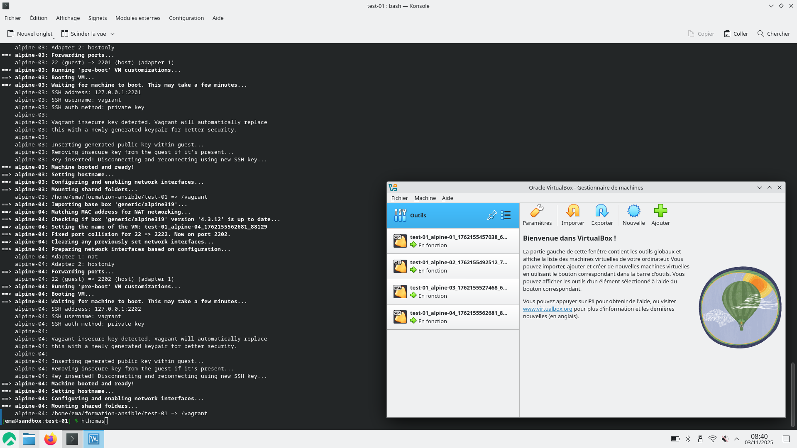

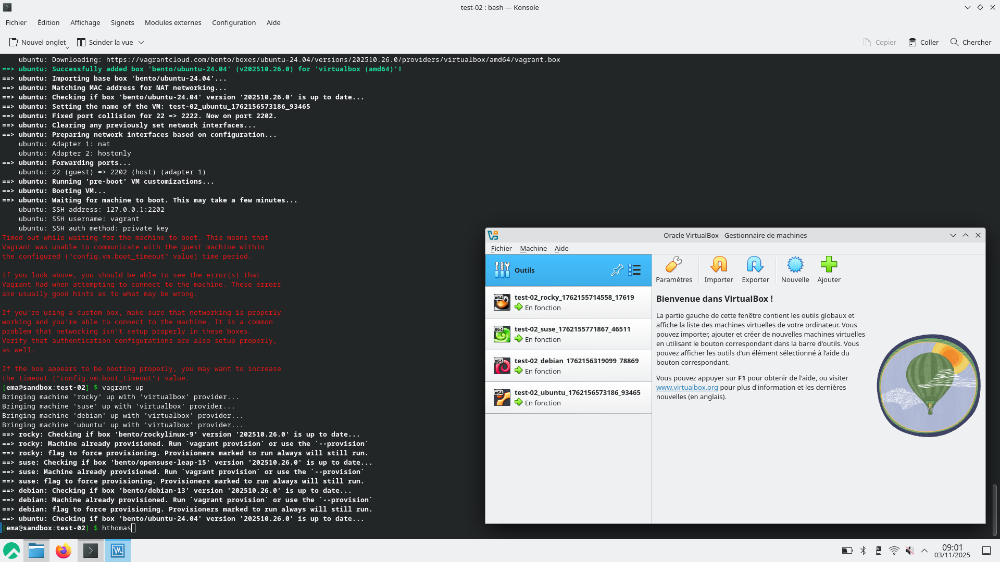

Cela montre que notre la lab est opérationel et que nous somment prêt à pouvoir faire les challenge.

## Challenge 1

On commence par créer un machine virtuelle debian avec la commande `vagrant up debian`.

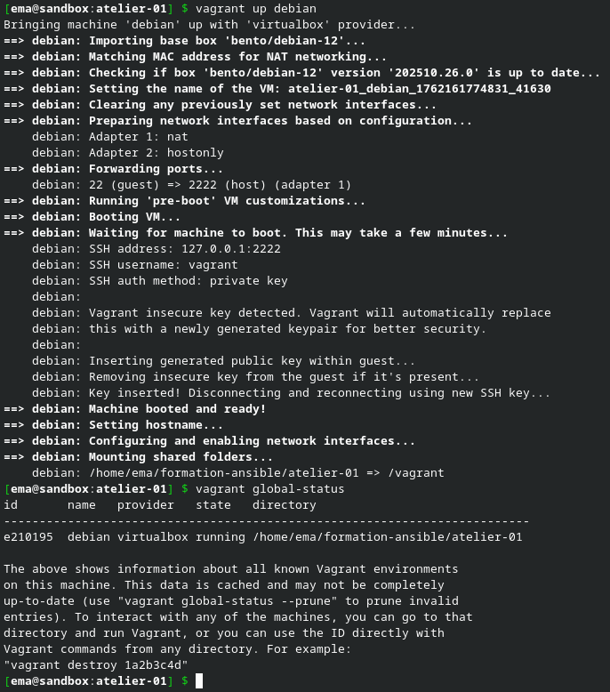

Ensuite pour avoir accès à cette machine fraichement créer on utilise la commande `vagrant ssh debian`.

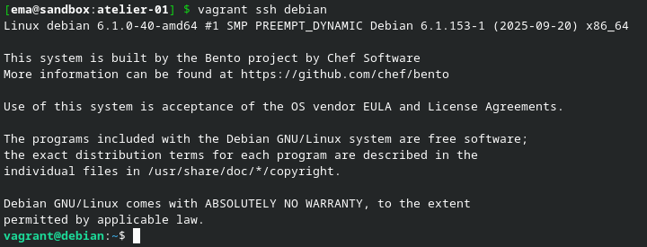

En arrivant sur la machine, on execute automatiquement `sudo apt update` pour mettre à jour la liste des paquets.

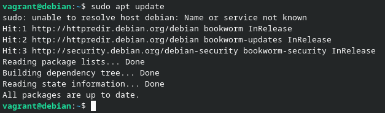

Pour rechercher quel est le bon paquet à choisir pour installe ansible on utlise la commande `apt-cache search ansible -n`.


Après avoir trouver le bon paquet ont l'installe avec la commande `sudo apt install ansible -y`

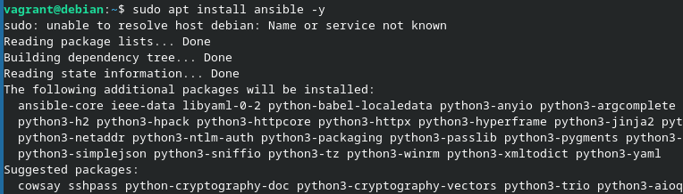

Ensuite pour être sûr que ansible est bien installé on peut vérifier sa version avec la commande `ansible --version`

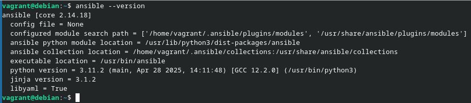

Pour ensuite se déconnecter de la vm et la supprimer on peut utliser les commande suivantes.

```bash
vagrant@debian:~$ exit
[ema@sandbox:atelier-01] $ vagrant destroy -f
```

## Challenge 2

On va reprendre la même façon de créer la machine virtuelle que le challenge.

Avant toute manipulation on verifie sur quelle distribution nous somment avec la commande `cat /etc/os-release`

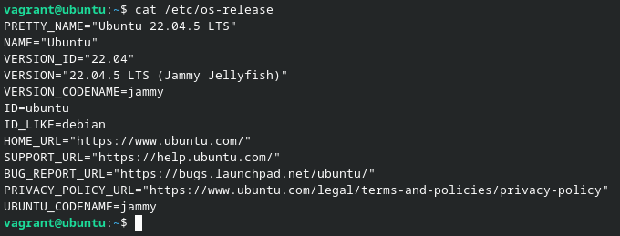

Pour ajouter de dépot PPA on utilise la commande suivante `sudo add-apt-repository --yes --update ppa:ansible/ansible`

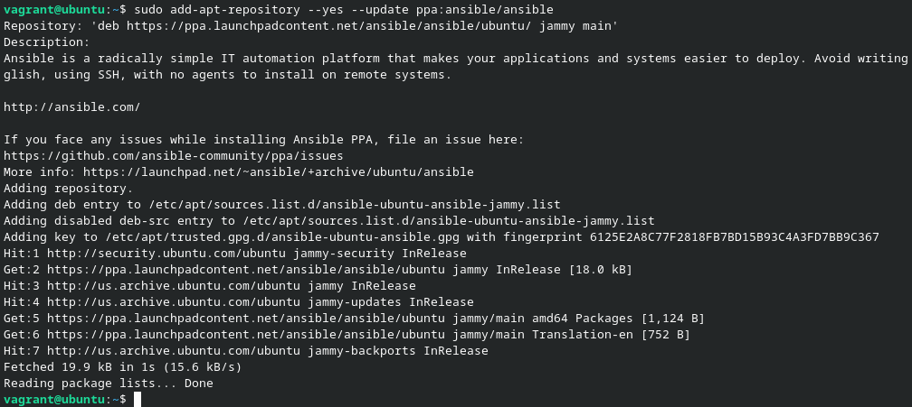

Et pour finir comme pour le challenge 1 on verifie la version de ansible.

> On note bien ici que la version est 2.17.14 or avec le repo par défaut nous étions avec la version 2.14.18

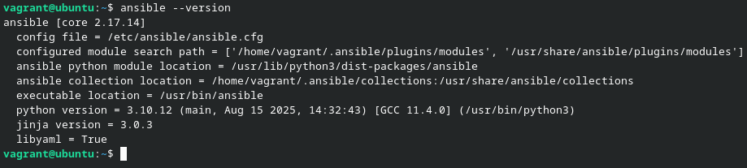

## Challenge 3

Cette fois, nous allons utiliser une machine virtuelle sous rocky donc pour cela nous allons utiliser la commande suivante `vagrant up rocky`

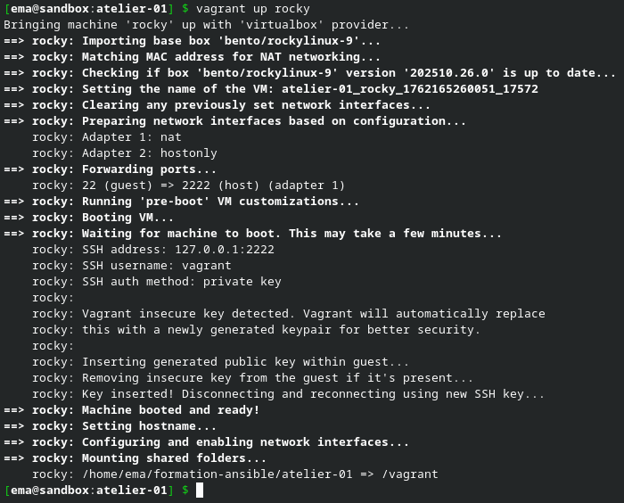

Ici pour mettre à jour les dépots sur rocky on utilise la commande `dnf update`

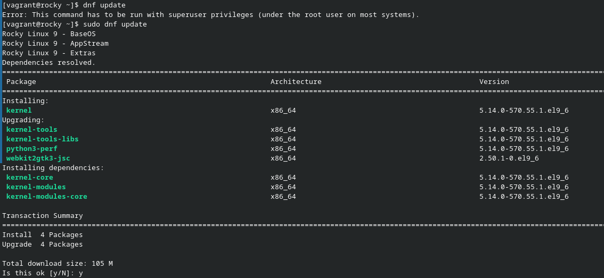

Pour installer python et pip on utilise la commande suivante `sudo dnf install python3 python-pip`

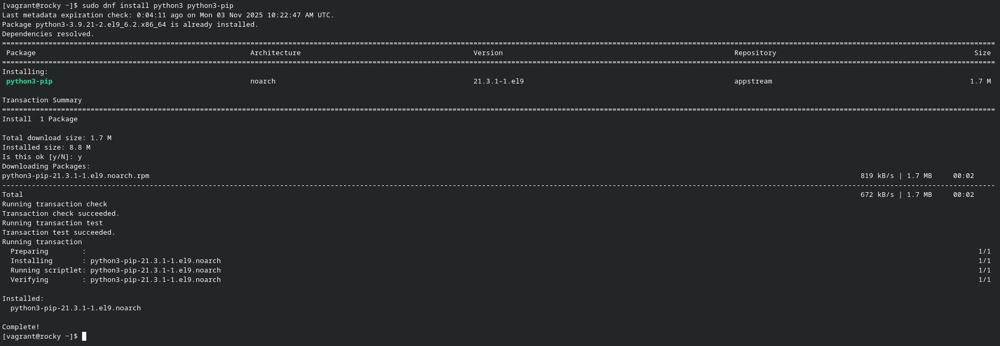

Pour être sûr que python est bien installé on utlise la commande suivante `python3 -m pip`

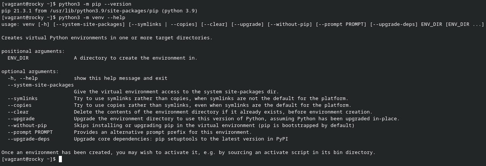

Pour pouvoir créer l'environement virtuel et ensuite l'activer on execute les commandes suivantes:

```bash
[vagrant@rocky ~]$ python3 -m venv ~/.venv/ansible
[vagrant@rocky ~]$ source ~/.venv/ansible/activate
(ansible) [vagrant@rocky ~]$
```

> On note bien l'apparition du `(ansible)` on début du prompt qui nous indique bien que nous somment dans l'environement virtuel.


Avant d'installer ansible, on met à jour pip avec la commande suivante `pip install --upgrade pip`

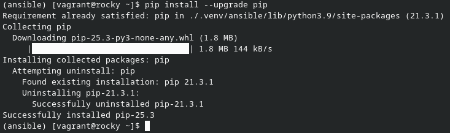

Maintenant nous pouvons installer ansible via pip avec la commande suivante `pip install ansible`

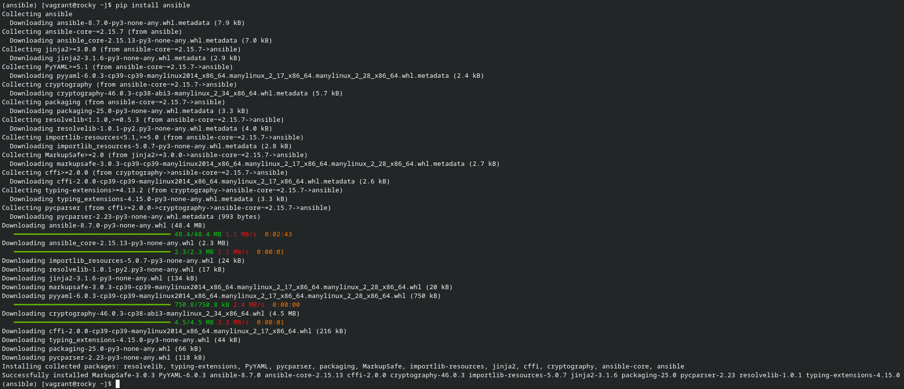

Et pour finir on vérifie la version de ansible installée.

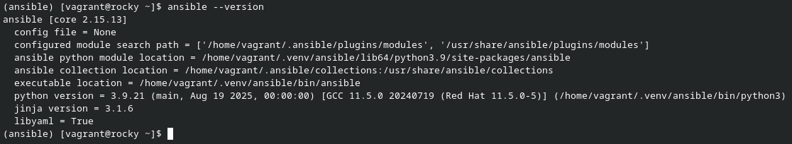

## Challenge 4

Pour commencer ce challenge, on vérifie que toute les machines sont démarrées et prêtes.

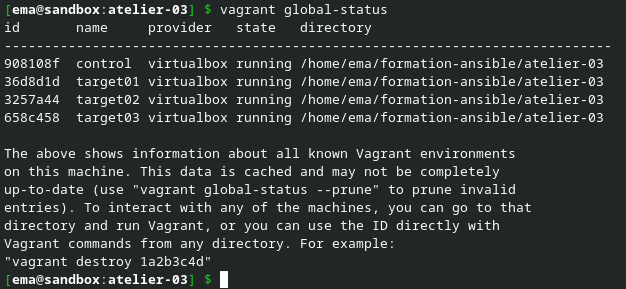

On se connecte sur la machine virtuelle de contrôle avec la commande `vagrant shh control`

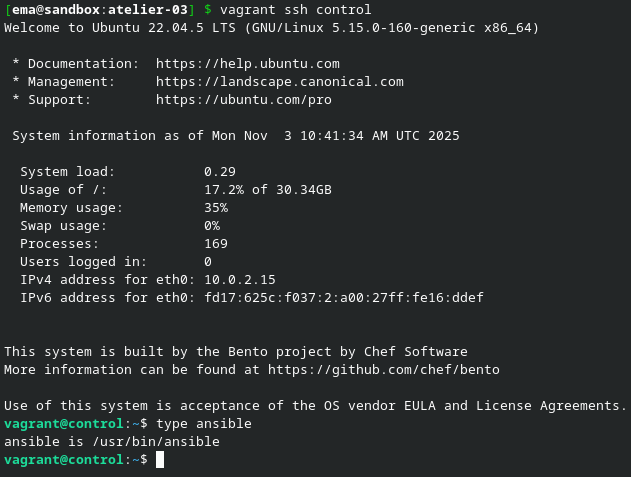

Pour que la machine de contrôle puisse accéder à tout les machines de son inventaire on ajoute les enregistrements nécessaire dans `/etc/hosts`

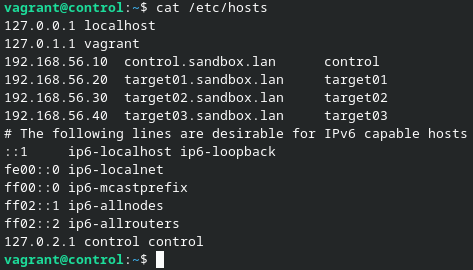

Pour tester si tout les pings marchent on utilise la boucle bask suivante `for HOST in rocky debian suse; do ping -c 1 -q $HOST; done`


Pour mettre en place l'accès par clé SSH sur toutes les cibles on ajoute en local tout les clé publique sur notre machine de controle. Pour cela on utilise la commande `ssh-keyscan -t rsa target01 target02 target03 >> .ssh/known_hosts` qui mettre toutes les clés dans le fichier `known_hosts`.

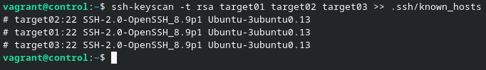

On peut faire le test avant d'appliquer l'authentification avec la commande `ssh target02`.

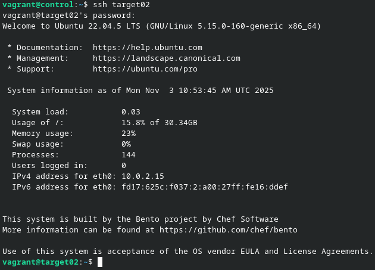

> On note bien que pour le moment le mot de passe est demander à chaque demande de connexion.

En premier, on génère une paire de clé SSH avec la commande `ssh-keygen`

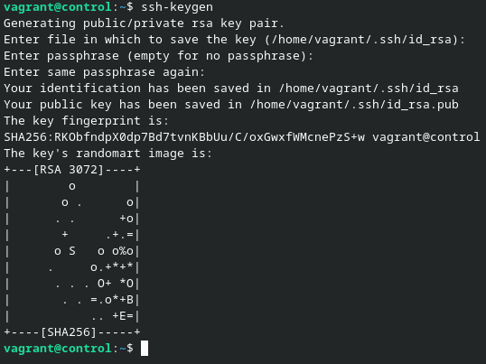

Pour que l'authentification pour clé SSH soit mise en place sur les machines on doit utiliser la commande suivante sur chacune d'entre elles:
```bash
ssh-copy-id vagrant@target<n° du target>
password : <rentrer le mot de passe>
```

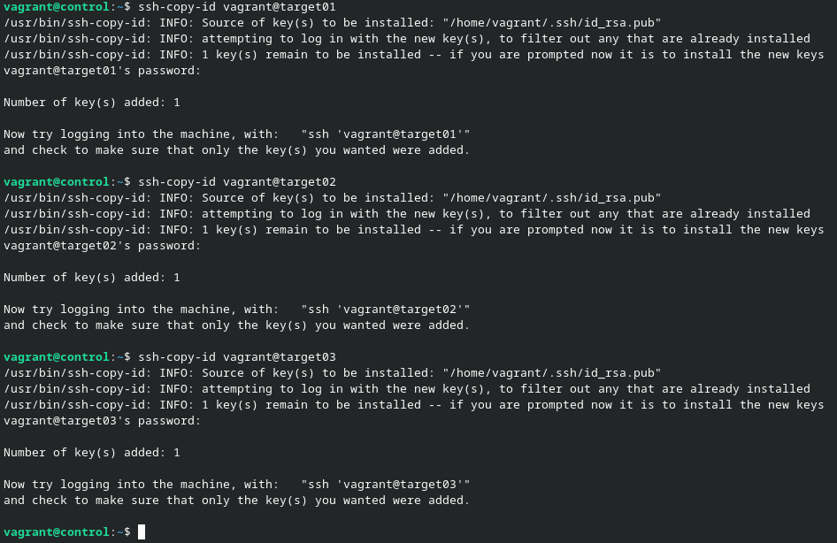

Et pour finir, pour valider que tout marche on utilise la commande suivante `ansible all -i target01,target02,target03 -m ping`

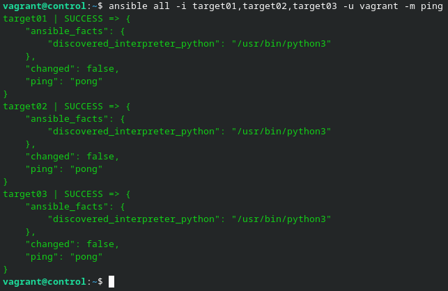
