## Challenge 5

On commence par éditer le fichier `/etc/host` pour que les target soient accesible par le nom au lieu de leur adresses IP.

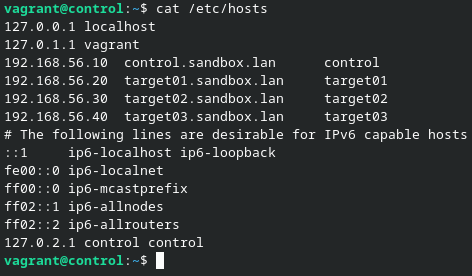

Pour mettre en place l'authentifactiojn par clé ssh on reproduit la précdure faite pour le challenge 4.
Et on obtient le résultat suivant:

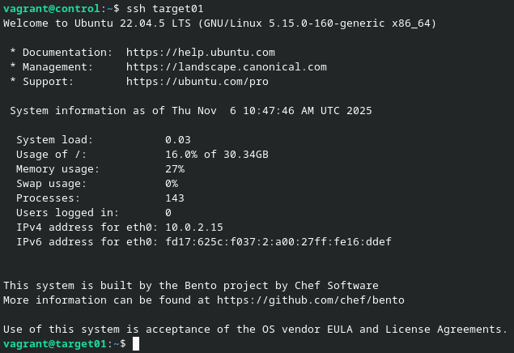

Pour effectuer le ping ansible on utilise la commande suivante `ansible all -i target01,target02,target03 -u vagrant -m ping`

> On note ici que -i precisse les targets -u precisse l'utilisateur et -m l'action

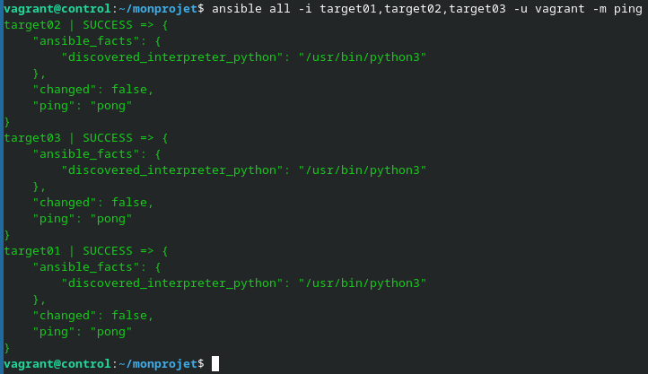

Pour créer le répertoire du projet rien de plus simple que:
```bash
mkdir monprojet
cd monprojet/
```

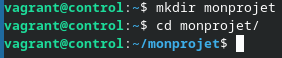

Tout d'abord il faut créer un fichier de configuration avec `touch ansible.cfg`. Ensuite avec la commande `ansible --version` le fichier de config doit être visible dans `config file = [...]`

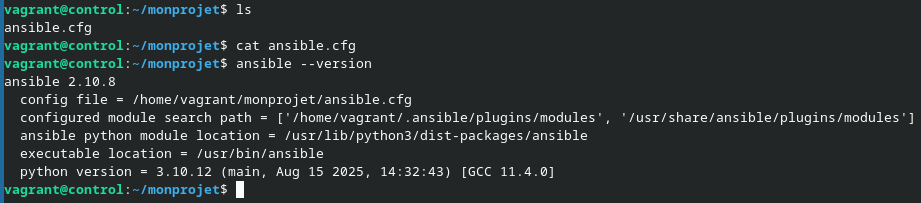

Pour créer un inventaire il faut d'abord le déclarer dans `ansible.cfg` en y ajoutant:
```
[defaults]
inventory = ./hosts
```
Puis dans le fichier hosts ajouté les targets de la manière suivante:
```
[testing]
target01
target02
target03
```

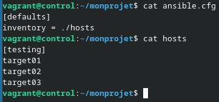

Pour ajouter la journalisation il suffit de créer créer le dossier `logs`, le fichier `ansible.log` et d'ajouter cela à `ansible.cfg`
 ```bash
 mkdir logs
 touch logs/ansible.log
 ```

 et ajouter `log_path = ./logs/ansible/log` à `ansible.cfg`

 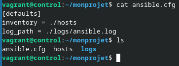

 Pour vérifier que les logs marche bien on peut faire la commande `ansible all -m ping`

 Et si tout marche bien la sortie de la commande est log dans `logs/ansible.log`

 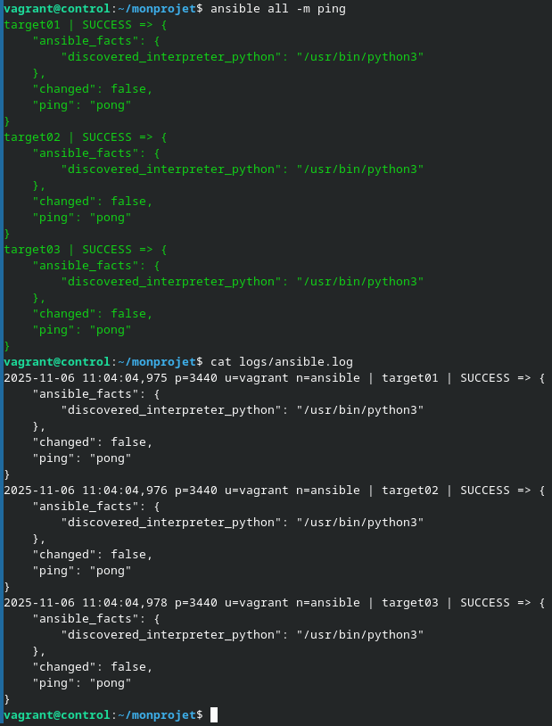

 Pour pouvoir obtenir l'élévation de droit pour les targets on doit ajouter des lignes dans `hosts`.

 ```
 [testing:vars]
 ansible_user=vagrant
 ```

 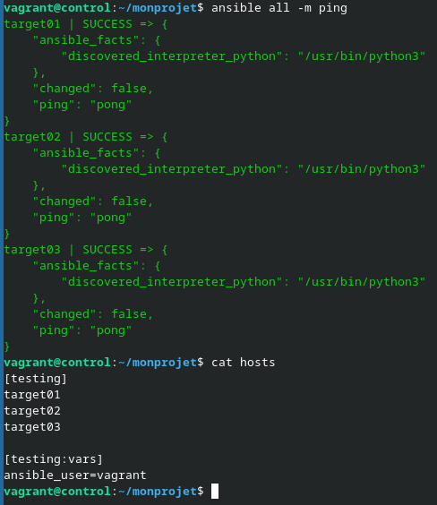

 Et pour finir pour afficher la première ligne de /etc/shadow des target on utilise la commande suivante `ansible all -a "head -n 1 /etc/shadow" -o`

 > On note bien que `/ect/shadow` est un fichier accessible seulement par root ce qui prouve bien notre élévation de droits.

 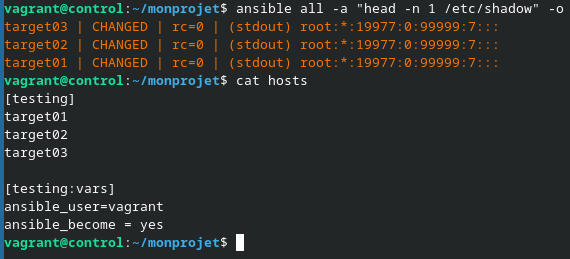

 ## Challenge 6

 Pour obtenire la place utilisable sur les targets on utilise `ansible all -m command "df -h /" -o`

 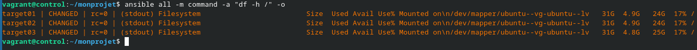

 Pour voir le nombre de process en cours on utilise la commande `ansible testing -m shell -a "ps -ef | wc -l"-o`

 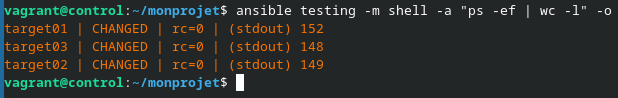

 Pour afficher un nombre aléatoire venant de chaque targer on utlise `ansible all -m shell -a "echo $RANDOM executable=/bin/bash" -o`

 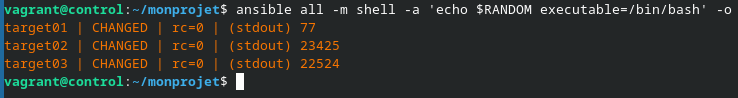

 Maintenant in installe cowsay sur tout les targets `ansible all -m package -a "name=cowsay"`

 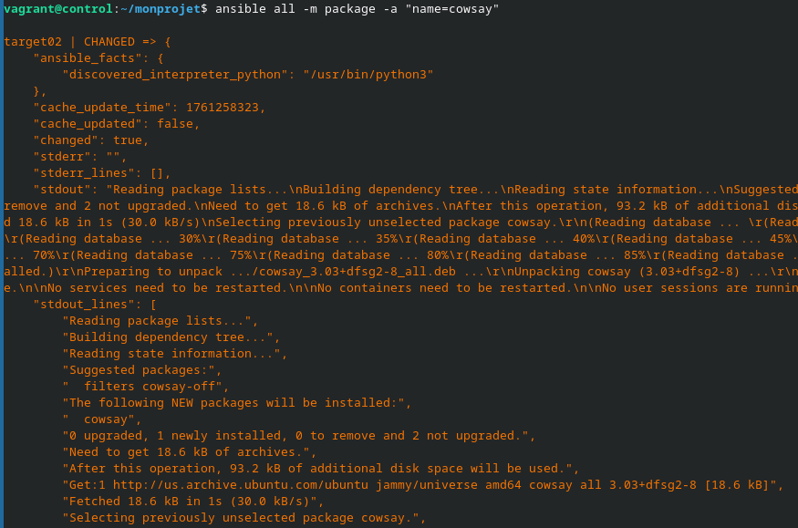

 Et puis le test final on lance cowsay sur tout les targets `ansible all -a 'cowsay bonjour'`

 

 ## Challenge 7

 Pour créer un utilisateur `greg` sur un target `target02` on utlise la commande suivante `ansible target02 -m user -a "name=greg shell=/bin/bash"`

 Et cela donne une sortie qui ressemble:

 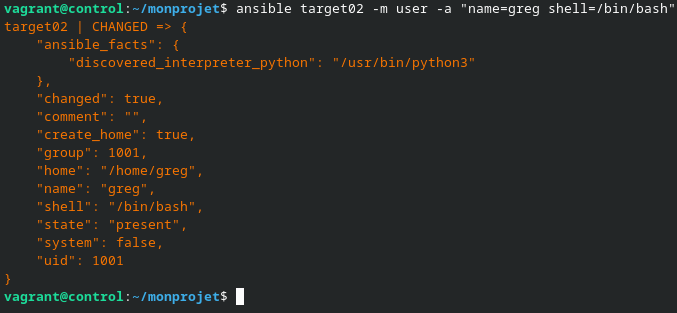

 Pour appliquer cela aux autre machines de l'inventaire on utilise cette fois-ci `ansible all -m user -a "name=greg shell=/bin/bash"`

Cela donne :

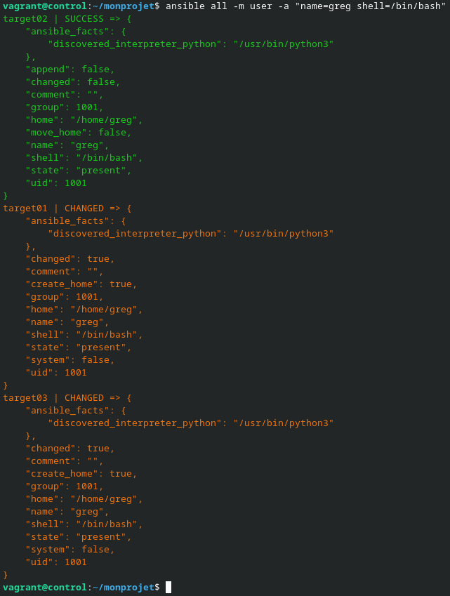

> On note que pour le targetO2 la commande affiche success, cela montre que l'utilisateur étais déjà présent donc pas besoin de l'ajouter.

Pour installer un paquet on utlise le module `package` et ici par exemple nous allons installer git sur les target avec la commande `ansible all -m package -a "name=git"`

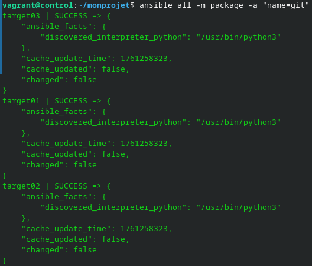

On refait la même manipulation avec `tree`, commande `ansible all -m package -a "name=tree"

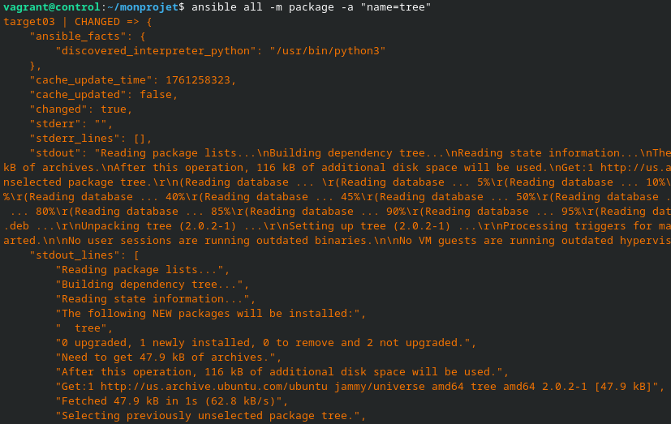

> note que cette fois la sortie brute de la commande est affiché

De la même façon on installe nmap:

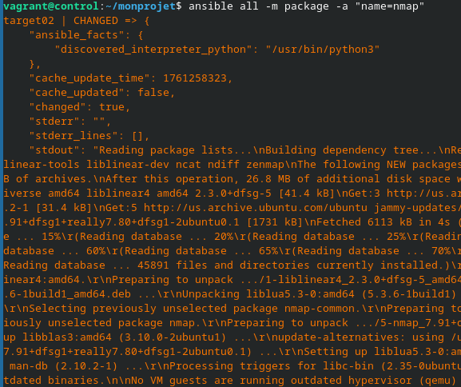

Mais imaginon que l'on veuille supprimer nmap et bien la syntaxe est assez proche il suffit d'ajouter l'agument `state=absent` et cela donne la commmande `ansible all -m package -a "name=nmap state=absent"`

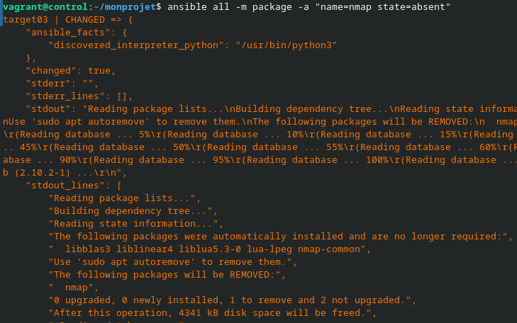

de la même manière on peut supprimer les autres paquets comme bon nous semble.

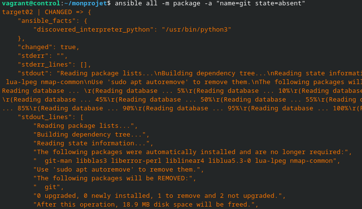
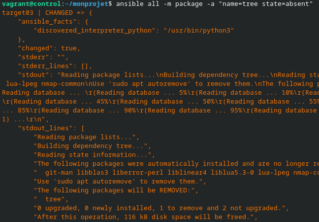


