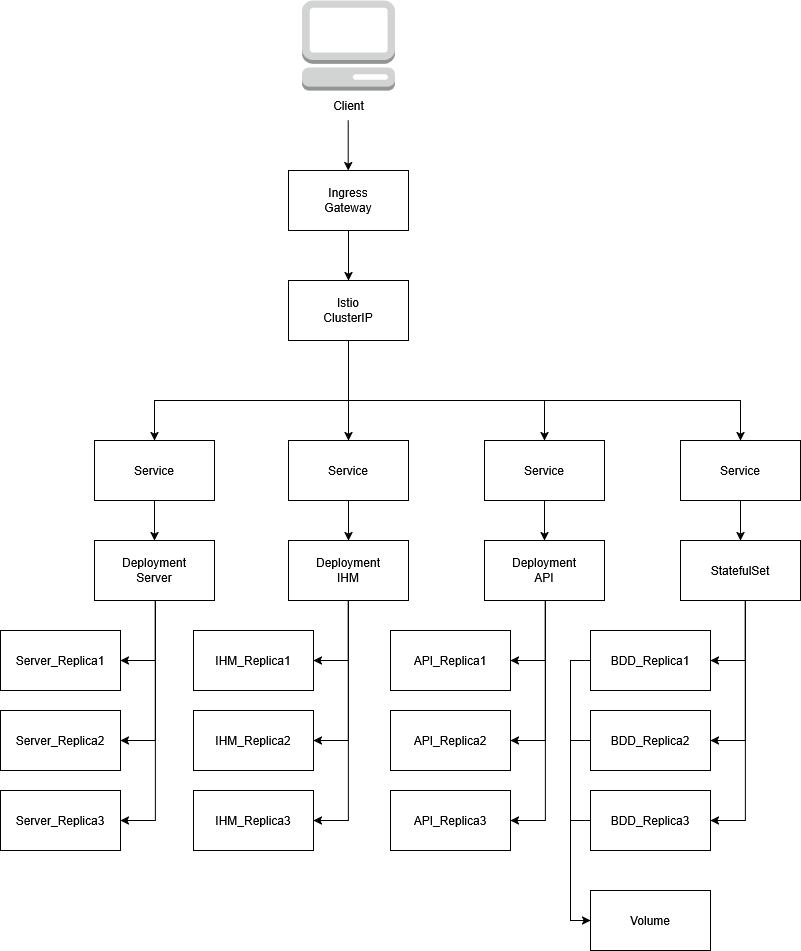

# Sécurité applicative

## Kubernetes  
Afin de rassembler et sécuriser nos différents services, nous avons utilisé Kubernetes. C'est un outil qui permet d'orchestrer des conteneurs afin de faciliter le déploiement, de gérer les charges ou de sécuriser la communication entre nos services.

### Pods  
___
Pour qu'il y ait de la redondance et ainsi assurer la disponibilité de nos services, nous avons mis en place des *deployments*. Sur Kubernetes, les *deployments* permettent de déployer plusieurs pods d'un même service afin d'assurer que le service soit toujours accessible. Par exemple, si on choisit de déployer 3 pods (A, B et C), si le pod A tombe alors Kubernetes le redémarrera automatiquement et ce sont les pods B et C qui prendront la charge.

### Volumes  
___
Notre application possède une base de données. Cependant, les pods Kubernetes ont comme particularité d'être sans état, ce qui évidemment pose souci lorsque l'on souhaite conserver des données. Pour ce faire, il faut créer un *volume* qui sera un emplacement mémoire dans lequel seront enregistrées les informations de la base de données. Cet emplacement mémoire est ici de taille fixe, nous avons choisi d'avoir au maximum 1 Go de disponible pour la base de données.  
Pour que Kubernetes lie ce volume à notre pod, nous avons utilisé un *persistent volume claim* qui alloue un volume selon le tag présent dans le pod.

Pour avoir plusieurs bases de données en parallèle, on peut utiliser *StatefulSet*. Leur but est de créer des réplicats avec des données persistantes, ce qui permet d'assurer la disponibilité du service.

### Communication interne 
___
Maintenant que nous avons nos différents services et bases de données qui fonctionnent dans leur pod respectif, il serait intéressant qu'ils puissent communiquer entre eux. C'est à ça que servent les *services* sur Kubernetes avec l'utilisation de *Istio*. Ils permettent de rediriger les ports des pods vers les ports du réseau interne du namespace Kubernetes.

Pour l'instant, tous les pods peuvent communiquer entre eux. Mais ce n'est pas le plus sécurisé, certains pods n'ont pas d’intérêt à communiquer et il vaudrait mieux empêcher toute communication entre eux. Les *NetworkPolicies* répondent à ce problème. Grâce à elles, on peut empêcher à quiconque d'atteindre l'API autre que l'IHM, par exemple.  
Voici les seules communications autorisées au sein de notre namespace.

Lors de nos tests, on a dû rendre accessible l'API via l'extérieur après un problème technique. Il n'est pas conseillé d'ouvrir une API sur le web car cela représente une vulnérabilité supplémentaire que les hackers peuvent exploiter.  
Suite à quelques modifications et à l'utilisation du DNS interne de Kubernetes, on a réussi à faire communiquer l'IHM et l'API sans avoir à ouvrir l'API sur le net. Pour ce faire, nous avons paramétré notre serveur *nginx* pour qu'il redirige tous les liens qui contenaient */api*. Ce qui nous permettait de pouvoir également communiquer en http entre le serveur *nginx* et l'API de manière sécurisée.

### Accès à l'extérieur  
___
**Ingress**  
Pour l'instant, les pods peuvent communiquer entre eux mais il n'y a aucune porte de sortie pour qu'on y accède. C'est pour cela que nous avons mis en place une *gateway*, une *httproute* et une *tcproute* afin de pouvoir rediriger les informations, les sécuriser et les transmettre vers l'extérieur grâce à l'API *Ingress* de Kubernetes.
Pour sécuriser nos transactions, nous avons mis en place une communication https avec l'utilisation de certificats *Let's Encrypt*. Ces certificats ne doivent pas être utilisés lors d'une mise en production mais, dans un contexte de débogage ou éducatif, ils feront très bien l'affaire.  
Depuis l'extérieur, les seuls services autorisés à sortir par la gateway sont l'IHM et le serveur. L'API et la BDD restent inaccessibles afin d'éviter toute fuite ou tentative d'atteinte à leur disponibilité.

