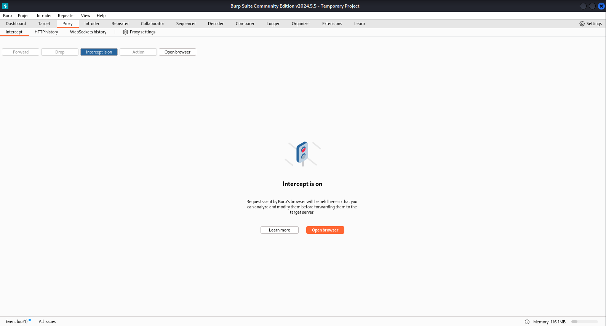
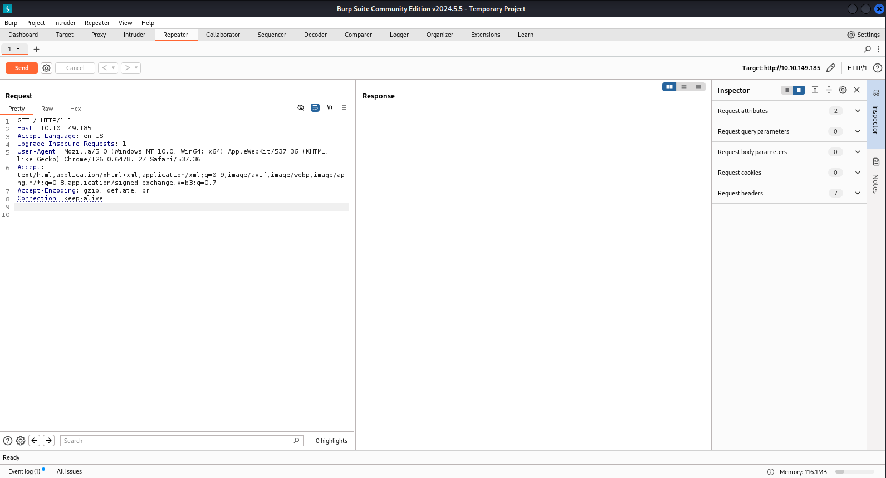
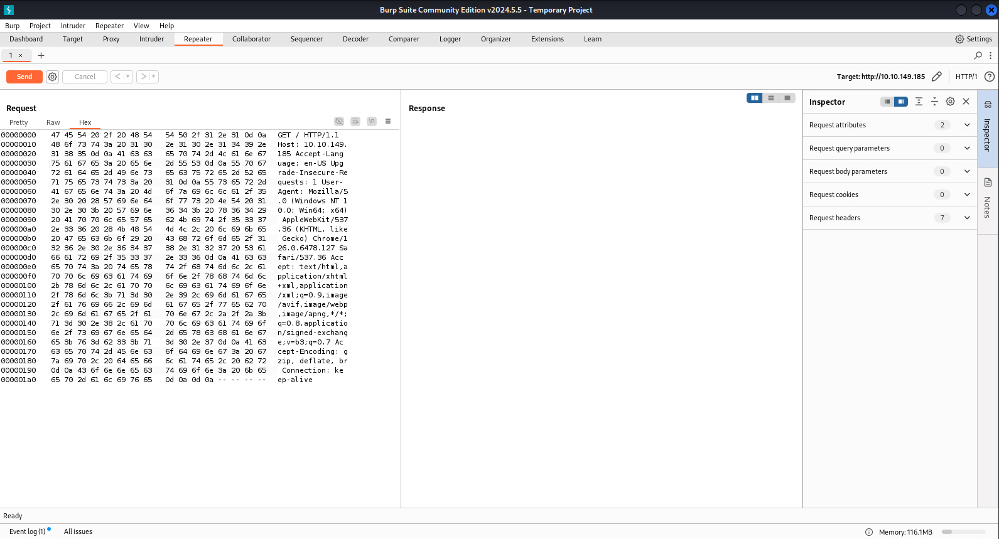

# TryHackMe : Burp

Ce TD permet de découvrir la suite Burp et d'essayer la récupération et la modification de requêtes.

## Intercepter des requêtes

Via l'onglet proxy, on peut activer la récupération de requête grâce au navigateur fourni avec la suite.

Dès qu'on a intercepté la requête, on peut l'envoyer au repeater avec `CTRL+R` ou clique droit.

Voici ce qu'on obtient dans l'onglet Repeater.

On peut changer l'affichage de la requête comme en Hexadecimal par exemple.

## Modifier les requêtes

Maintenant, qu'on a notre requête, on peut la modifier avant de l'envoyer au server.

Ajoutons "FlagAuthorised : True" au header.

Voici notre premier flag.

## Tester des EndPoints

Voyons voir si notre cible ne possède pas différents endpoints. 

Par exemple `product/2`:

Ok, ça fonctionne. Essayons d'en faire quelque chose via Burp Repeater.

À la suite de `/product/`, il nous faut un id. Ils sont toujours positifs logiquement, essayons de rentrer quelque chose d'incohérent.

Sur la page d'erreur, il se trouve un deuxième flag.

## Tests injections SQL

Sur ce site, il se trouve également des pages `/about/`.

Tout comme précédemment, il se trouve sûrement quelque chose d'utile sur la page d'erreur. Ajoutons un `'` après l'idée pour essayer de lancer une erreur SQL.

Étrangement, le server nous renvoie la requête SQL qui a plantée. Pour eux, c'est une immense faille de sécurité, mais pour nous ça sera bien pratique puisqu'on obtient des noms de colonnes, tables...

On peut essayer d'obtenir des informations supplémentaires en modifiant la requête SQL initiale pour la transformer en UNION ou encore en TRANSACTION.

``/about/2 UNION ALL SELECT column_name,null,null,null,null FROM information_schema.columns WHERE table_name="people"` 

Lorsqu'on rentre un ID, une page d'employé est retournée.

Si cet ID est 0, c'est la liste des colonnes de la table `people` qui nous est renvoyée.

`ìd, firstName, lastName, pfpLink, role, shortRole, bio, notes` 

Pour obtenir le dernier flag, il faut récupérer les notes du CEO. Ce dernier est l'ID 1 dans la BDD.

Voici ce qui conclut ce TD de TryHackMe sur Burp Repeater.

Réponse aux questions :

