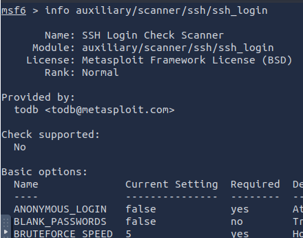
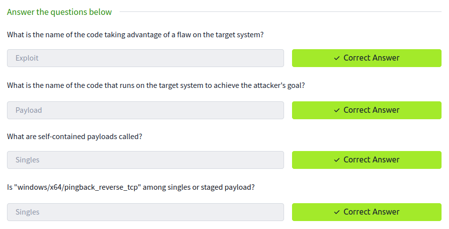
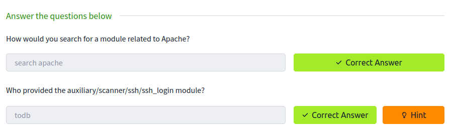
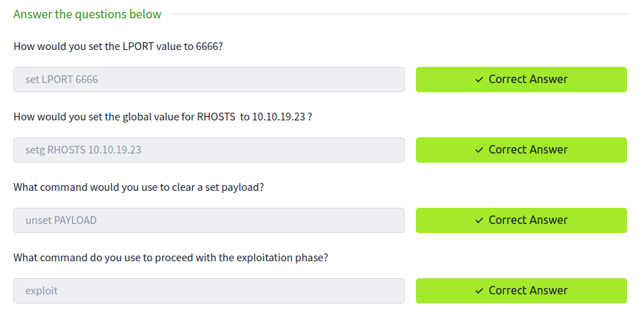

# TryHackMe : Metasploit

L'objectif de ce TD est de découvrir `Metasploit` et ses différentes options.

## Manipulation

La seule manipulation qui a été nécessaire, est de retrouver le provider de l'exploit `auxiliary/scanner/ssh/ssh_login`.

Réponse aux questions :

