# Basic Pentesting 1

L'objectif de cette VM est d'obtenir les droits d'administrations sur le site web et les droits root sur la machine cible.

## Sommaire

1. [Mise en place](#Mise-en-place)
2. [Site internet](#Site-internet)
3. [FTP](#FTP)

## Mise en place

Avec `netdiscovery` et `nmap`, faisons un peu de reconnaissance.

Machine hôte : **192.168.1.51**

Machine cible : **192.168.1.37**

Ports disponibles :

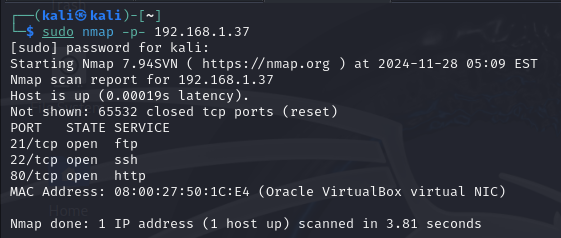

## Site Internet

Sur le port 80, il y a un service http qui tourne. Avec un navigateur, cela donne :

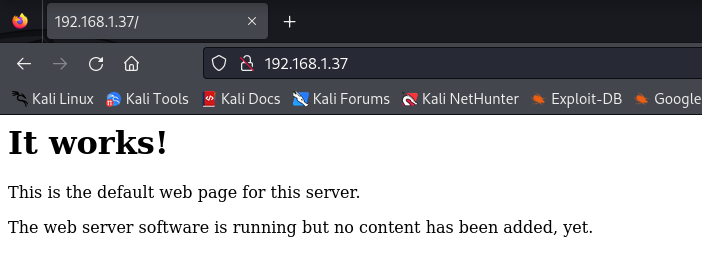

Pour attaquer un site internet, on peut utiliser `nikto`, `dirb` ou encore des programmes spécialisés par CMS.

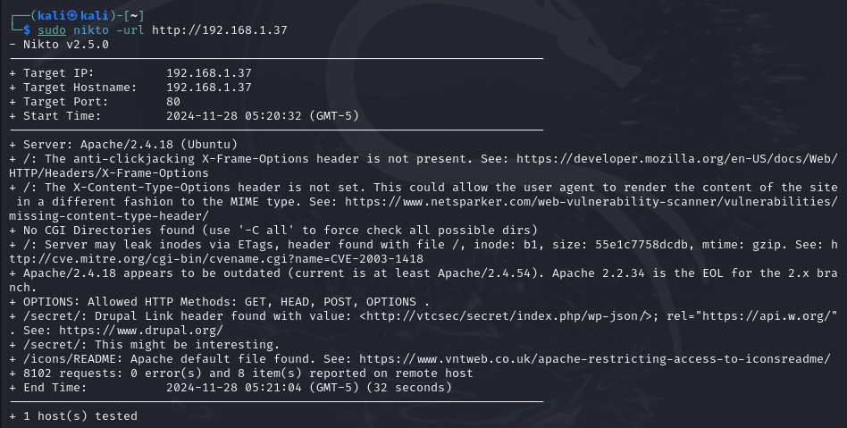

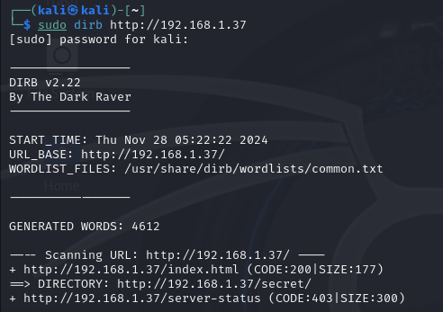

D'après `dirb`, il y a une page à l'adresse `/secret`.

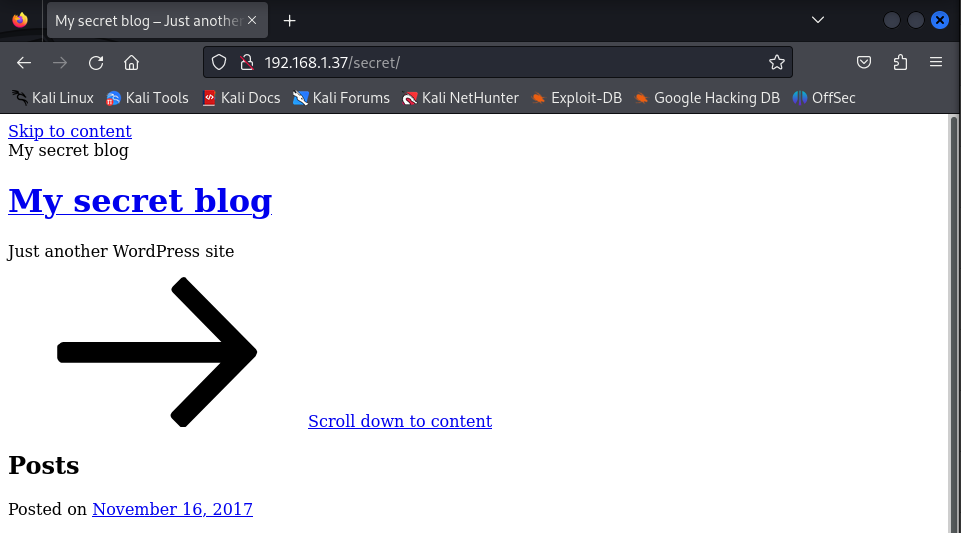

Vu que l'on sait que le site tourne sur WordPress, lançons WPScan pour trouver des vulnérabilités.

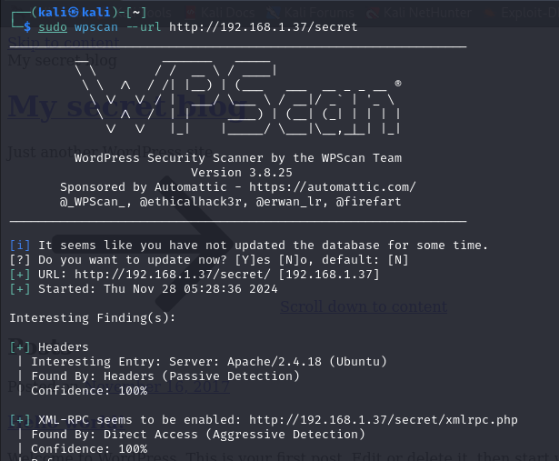 

Avec WPScan, on peut trouver les utilisateurs disponibles.

`sudo wpscan --url http://192.168.1.37/secret --enumerate u`

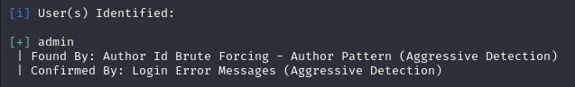

On a un nom d'utilisateur, maintenant il nous reste à brute force le mot de passe.

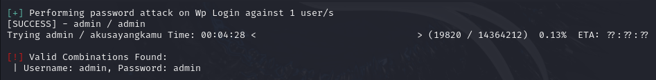

Sans développer sur ces identifiants. On peut à présent se connecter à la page d'administration du WordPress.

## FTP

Avant de s'interesser au port ftp, obtenons plus d'information grâce à nmap.

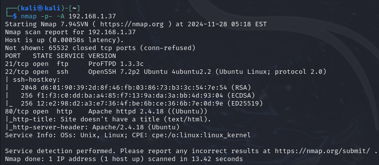

Cherchons s'il y a des exploits disponibles sur la version 1.3.3c de ProFTPD.

![searchploit]

Il y a bien un exploit. Lançons le avec Metasploit pour avoir une backdoor sur la machine cible et avoir les droits root.

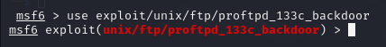

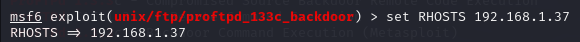

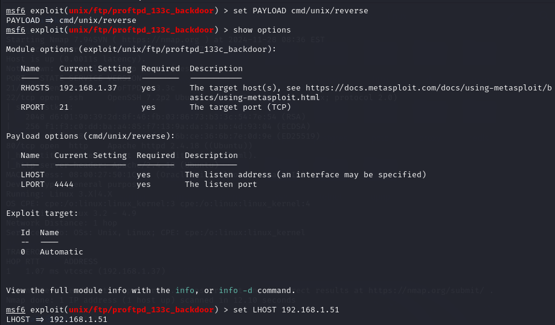

On choisit d'utiliser le payload `reverse shell`.

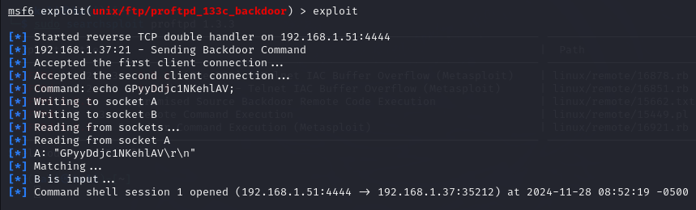

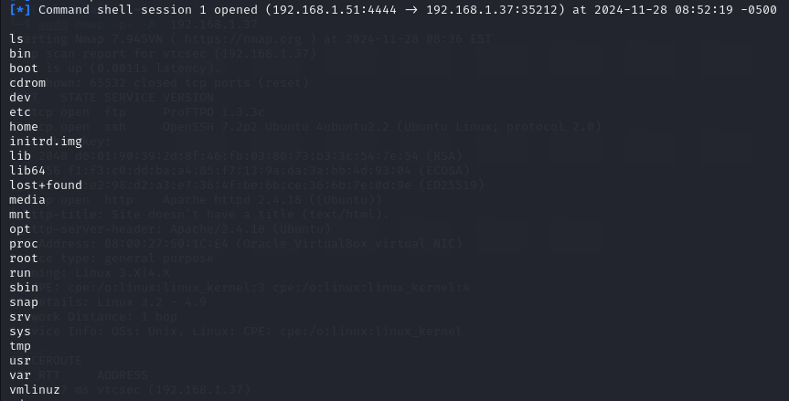

Voilà, nous avons actuellement des droits root sur la machine cible.

