# RickdiculouslyEasy

---

L'objectif de cet exercice est de trouver les 8 ou 9 flags présents dans la machine cible.
J'ai utilisé un VM Kali en tant que machine hôte.

## Sommaire

1. [Mise en place](#mise-en-place) 
2. [Flag 1 (port 13337)](#flag-1)
3. [Flag 2 (port 60000)](#flag-2)
4. [Flag 3 (port 21)](#flag-3) 
5. [Flag 4 (port 9090)](#flag-4) 
6. [Flag 5 (port 80)](#flag-5)
7. [Flag 6 (port 22222)](#flag-6) 
8. [Flag 7 (port 22)](#flag-7)

## Mise en place

---

Avant tout, il faut trouver la machine que l'on souhaite attaquer.
On utilise tout d'abord une commande affichant les machines présentes sur le réseau.
`sudo netdiscovery -r`

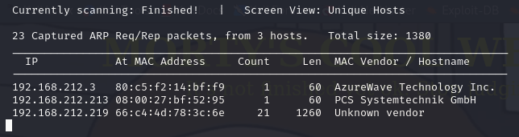

Ensuite, on vérifie qu'elle est l'adresse de notre machine.
`ip -a`

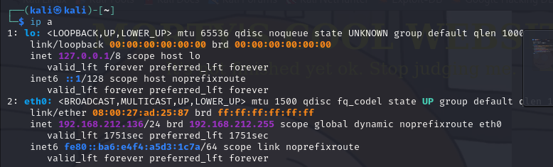

Maintenant, on sait que l'on souhaite se connecter à la machine avec l'adresse **192.168.212.213**.
La commande `nmap` avec l'argument `-p-` permet de scanner tous les ports ouverts.
`nmap -p- 192.168.212.213`

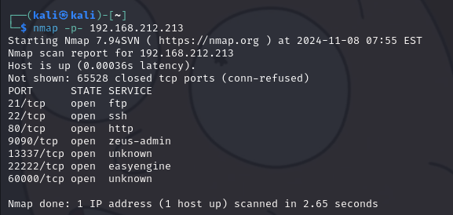

Nous avons à présent une liste de ports où trouver les 7 différents flags.
On va voir quel est la procédure que j'ai faite pour accéder à chaque flag.

## Flag 1

---

La commande `nmap` ne connaît pas le type de service lié au port 13337.
Pour obtenir plus d'information sur celui-ci, utilisons la commande `netcat`.
`nc 192.168.212.213 13337`

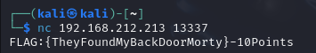

Voici notre premier flag.

## Flag 2

---

De la même façon, nous allons utiliser la commande `netcat` sur le port 60000.
`nc 192.168.212.213 60000`

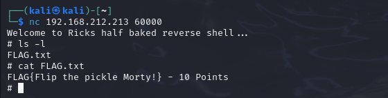

On arrive alors *Reverse Shell fait à la va-vite de Rick*.
Et si on affiche le contenu du dossier en cours, on retrouve un FLAG.txt qui contient notre deuxième flag.

## Flag 3

---

Le port 21 correspond au service ftp. Dans ftp, on peut se connecter en *anonymous*. Ce qui signifie qu'il n'y a pas besoin de connaître d'identifiant puisqu'il est possible de se connecter avec le nom d'utilisateur "anonymous" et un mot de passe vide.
 Essayons de voir si c'est le cas sur notre cible.
 `ftp 192.168.212.213`

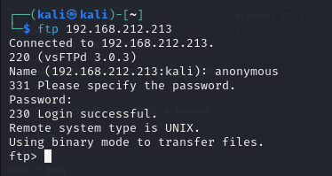

 Cela a fonctionné, nous sommes connectés à la machine **192.168.212.213** en ftp.
 Tout comme avec notre reverse shell, regardons ce qu'il se trouve dans ce dossier.
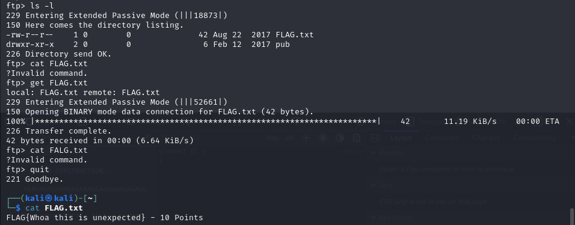

 Et ça nous fait un troisième flag.

## Flag 4

---

Le port 9090 utilise le service "zeus-admin". 
Plutôt que d'utiliser la commande `netcat`, on peut partir du principe que c'est un service web.
Du coup, on essaye de se connecter via un navigateur web à `https://192.168.212.213:9090`.

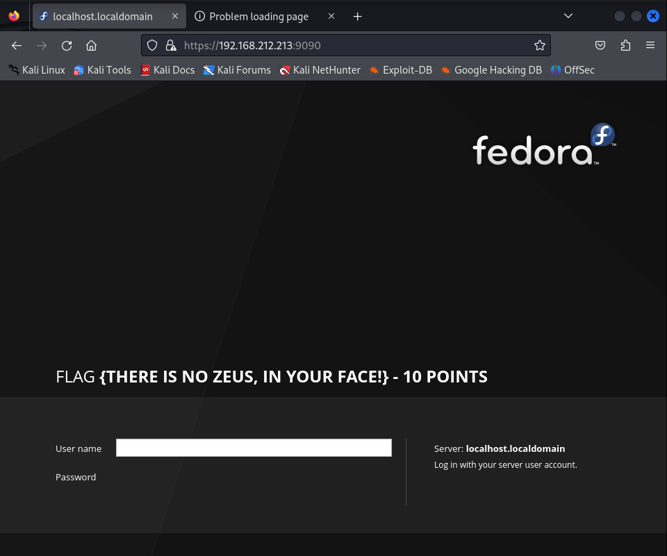

Voilà, notre page de configuration de Fedora avec un beau flag en son centre.
Ce qui nous donne notre quatrième flag.

Au cas où, il y aurait des pages cachées.
On peut utiliser dirb qui permet de lister d'éventuelles pages cachés dans notre site web.
`dirb https://192.168.212.213:9090`

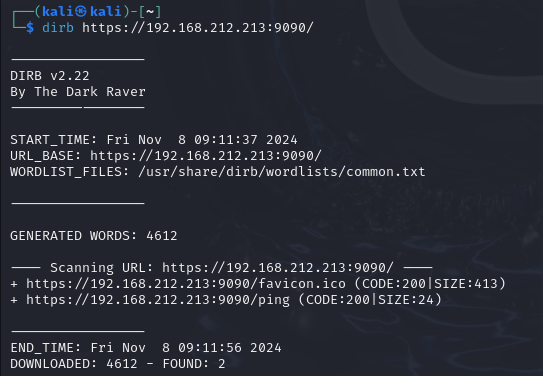

Il semblerait qu'il n'y ait rien d’intéressant de caché.

On peut aussi utiliser `nikto` pour vérifier si il n'y a pas de faille connue sur ce service.

`nikto -h 192.168.1.47`

## Flag 5

****

Le port 80 utilise un service web apache.
On peut déjà vérifier dans un navigateur ce qu'il s'affiche.

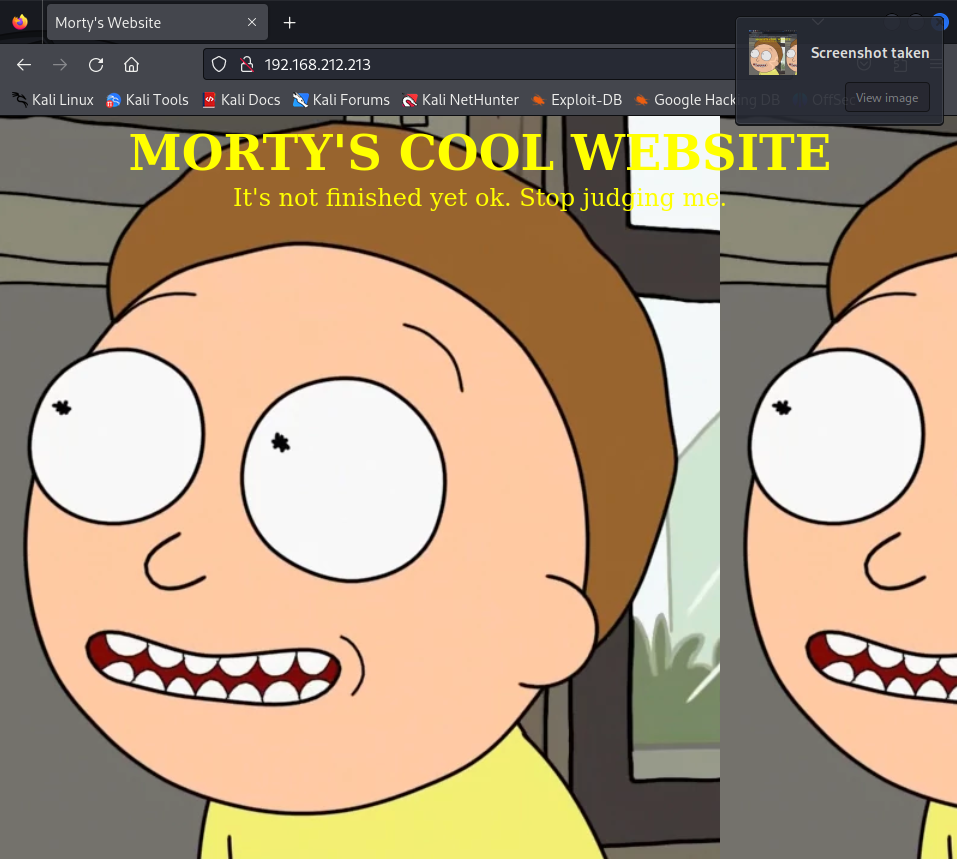

On récupère la page html pour voir s'il n'y rien de caché à l'intérieur.
`wget 192.168.212.213`

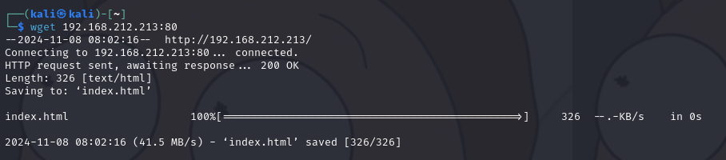
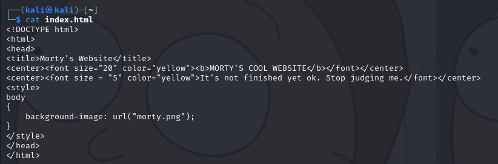

Finalement, on remarque qu'il n'y a rien d'intéressant.
Vérifions avec dirb d'éventuelle pages cachées.
`dirb http://192.168.212.213:80`

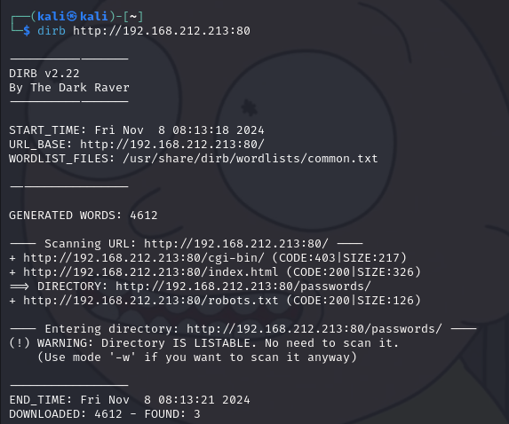

Regardons ce qu'il y a dans ces différentes pages.

`/passwords/` :

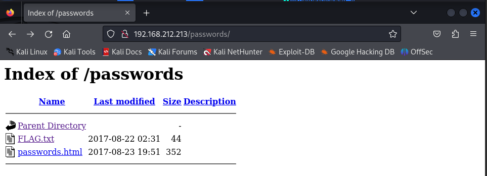

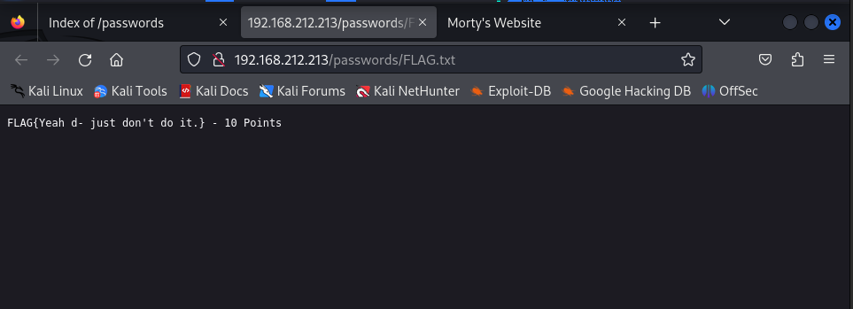

Tout d'abord, il y a le cinquième flag, voilà une bonne chose de faite.
Ensuite, il y a quelque chose de plus croustillant *password.html*.

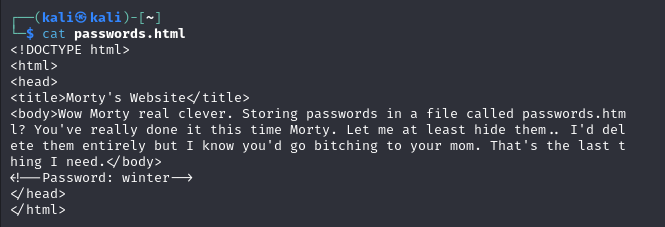

Ok, maintenant nous avons un mot de passe 'winter'. Gardons ça d'un côté de notre tête. Il nous reste plus qu'à avoir un nom d'utilisateur.

## `/cgi-bin/`:

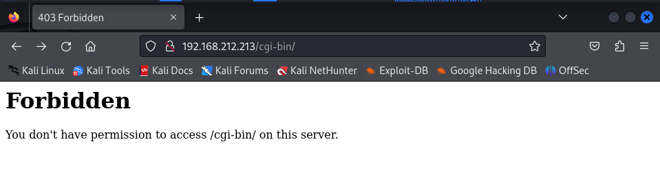
 Pour l'instant, nous avons pas l'accès à cette page.

## `/robots.txt`:

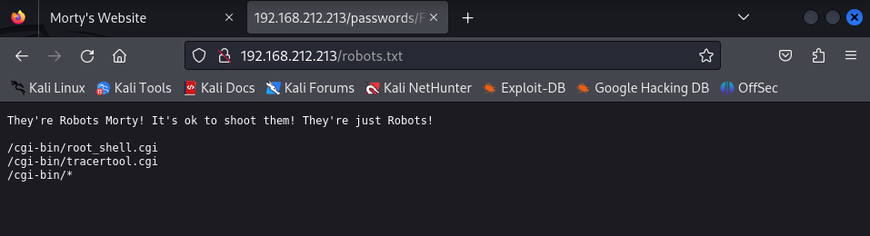
Réessayons le lien précédent avec ces nouvelles informations.

**root_shell :**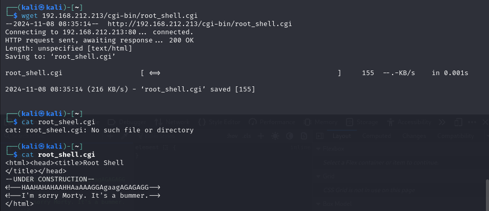

Cette page ne contient pas grand chose d'utile.

____

**traceroute :**

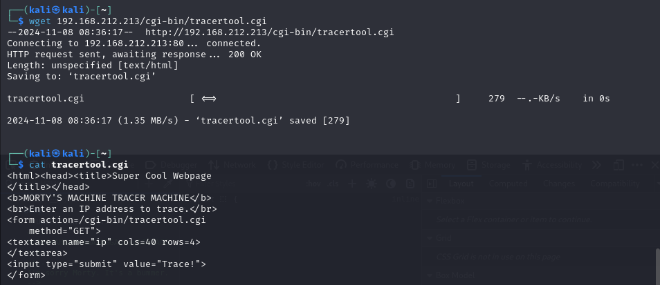
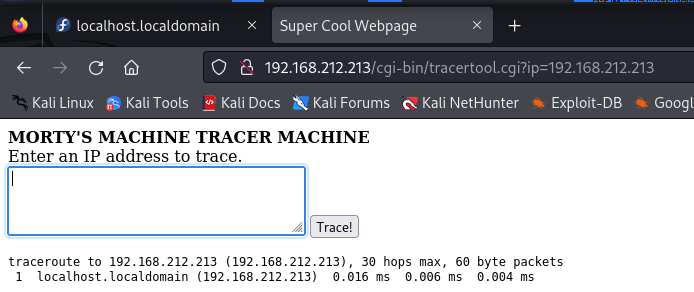

On arrive sur une page qui nous permet de tracer une adresse ip. Plus précisément, elle nous permet de lancer une commande via le champ de texte sur la machine hôte du site. 

____En bash, il y a plusieurs façon de lancer une commande à la suite de la précédente :____

`a&&b` : b se lance si a fonctionne.
`a||b` : b se lance si a ne fonctionne pas.
`a;b` : b se lance après a.

A présent, voyons ce qu'on peut obtenir comme information. 
`localhost; more /etc/passwd` 

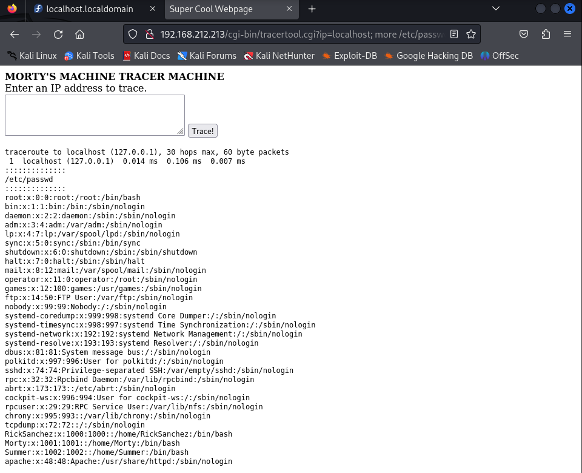

Tiens, il y a un utilisateur `Summer`, pourquoi ne pas essayer s'il fonctionne avec `winter` ?

## Flag 6

---

On a un service ssh sur le port 22222. Avec on a un nom d'utilisateur et un mot de passe, pourquoi ne pas se connecter ?

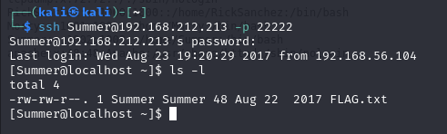

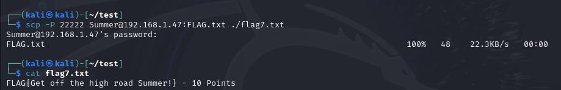

Récupérons ce fichier sur notre machine hôte.

`scp -P 22222 Summer@192.168.1.47:FLAG.txt ./flag7.txt`

On a obtenu un nouveau flag !

## Flag 7

Dans notre session SSH, on peut se balader dans la machine cible et on trouve alors de nombreux dossiers avec des fichiers qui peuvent nous interesser.

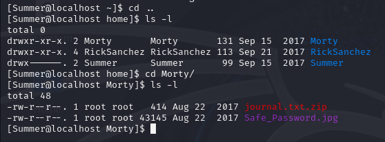

Récupérons `Safe_Password.jpg` sur notre machine et examinons le, parce qu'il est courant de cacher des informations au sein d'image.

`scp -P 22222 Summer@192.168.1.47:/home/Morty/Safe_Password.jpg ./flag6.jpg`

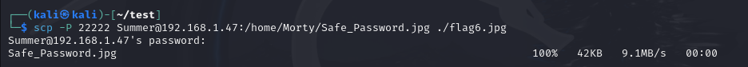

On peut afficher le contenu du image en texte.

`strings flag6.png` 

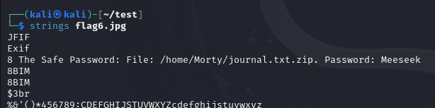

On a un mot de passe, il nous reste plus qu'à dézipper `journal.txt.zip`.

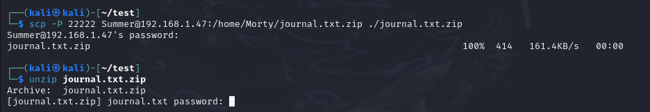

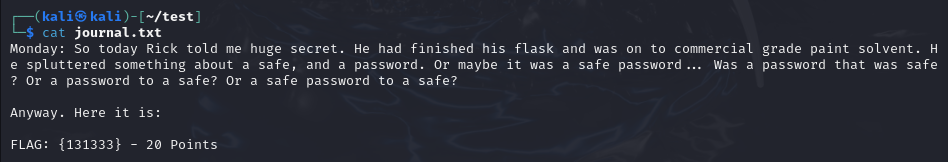

Voici un autre flag et le mot de passe du safe de Rick.

## Flag 8

Sur la machine cible, le seul dossier qui nous reste à fouiller est le dossier de RickSanchez pour trouver son safe.

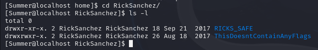

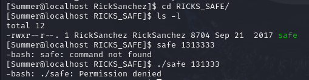

`safe` est un executable mais Summer n'a pas la permission de l'exécuter.

Cependant, je peux le copier et ainsi obtenir les droits d'exécution sur celui-ci.

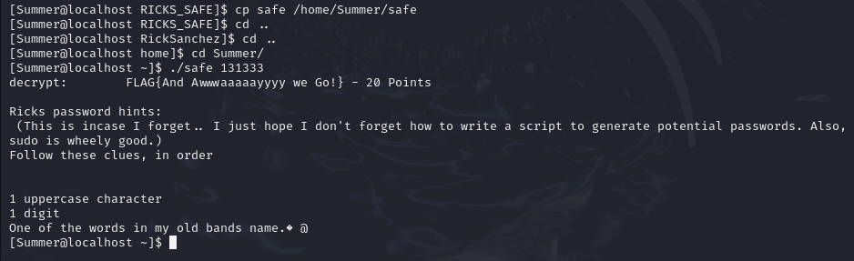

On a beaucoup d'information grâce à ce fichier, des indices sur le mot de passe de Rick et un nouveau flag.
