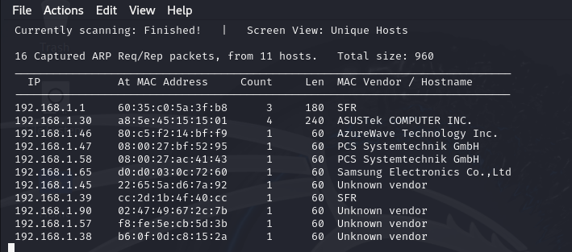

# VulnCMS

---

L'objectif de cette VM est de se connecter en admin à la machine cible et de retrouver un flag root et un flag user.

Elle permet de prendre en main les différents scanners de CMS et d'utiliser les exploits sur ces derniers.

## Sommaire

1. [Mise en place](mise-en-place)
2. [Port 80](Port-80)
3. [Port 5000](Port-5000)
4. [Port 22](Port-22)
5. [Port 9001](Port-9001)
6. [Metasploit](Metasploit)
7. [SSH](SSH)

## Mise en place

---

Comme d'habitude, on commence par un peu de reconnaissance.

`sudo netdiscovery 192.168.1.0`

Notre cible est la machine avec l'adresse ip **192.168.1.58**.

On vérifie l'adresse de notre machine hôte.

`ip a`

L'adresse de notre machine est **192.168.1.51**. 

Voyons voir quelle sont les ports ouverts sur la machine cible. L'argument -p- permet de scanner tous les ports.

`sudo nmap -p- 192.168.1.58`

Il y a 5 services sur notre machine cible, explorons les pour voir s'il n'y a rien d'intéressant pour accéder a nos flags.

## Port 80

Il y a un service http ouvert sur le port 80.

Essayons de voir ce que ça donne via un navigateur web.

C'est un blog des plus classique.

En essayant de rajouter un paramètre dans l'url, j'ai appris que c'est un server web sous nginx.

À voir si cela va nous servir plus tard.

Ensuite, sur les services web, il y a plusieurs outils qui sont à notre disposition : Nikto et Dirb en font partie.

`nikto -h 192.168.1.58 80`

Il n'y a rien qui me saute aux yeux donc je passe à dirb.

`sudo dirb http://192.168.1.58`

Il y a 2 fichiers de "cachés" sur ce port. Le premier `index.html` est uniquement la page précédente sans CSS. Alors que robots.txt :

Tiens, un `/about` est mentionné, voyons si cette page existe.

Il s'y trouve un texte quelque peu cryptique. Peut-être qu'il contient des indices, mais ne sachant pas l'interpréter, passons à un autre port.

## Port 5000

---

En utilisant un navigateur, on apprend que c'est un service web qui tourne sur ce port et plus précisément, c'est un site WordPress.

Il existe un outil permettant de scanner les sites utilisant le CMS WordPress.

`sudo wpscan --url http://192.168.1.58:5000`

WPScan propose plusieurs options, comme de pouvoir lister les utilisateurs liés au site.

`sudo wpscan --url http://192.168.1.58:5000 --enumerate u`

Il a bien trouvé un utilisateur du nom de "wordpress_admin".

On peut maintenant, grâce à WPScan, essayer de trouver son mot de passe par brute force en utilisant le fichier rockyou.txt comme base de données de mot de passe.

`sudo wpscan --url http://192.168.1.58:500 --passwords /usr/share/wordlists/rockyou.txt.gz --usernames wordpress_admin`

Cependant, cette méthode n'a pas été concluante.

Essayons dirb à présent.

`sudo dirb http://192.168.1.58:5000`

Alors la liste retournée est longue comme mon bras, donc on ne peut la voir d'un seul coup.

Essayons de se balader avec ces différents résultats. Le premier dossier trouvé est un dossier `/0` qui nous amène vers la page d'accueil.

Mais que se passe-t-il si l'on rentre un autre nombre tel que `/1` ?

Ça, c'est intéressant. Tout comme dans le tp précédent, essayons d'afficher les users de la machine cible.

`cat /etc/passwd`

Il y a 3 users qui nous sautent aux yeux : elliot, ghost et tyrell.

Pour vérifier ce pressentiment, j'affiche le contenu de `/home`.

Ok, ce sont bien nos users. On retient ça pour plus tard.

En se baladant, on trouve dans `/home/elliot/user.txt`. Ce qui ressemble grandement à un des 2 flags que l'on recherche. Cependant, on ne peut pas l'ouvrir, nous n'avons pas les autorisations nécessaires.

## Port 22

Maintenant, que nous possédons des noms d'utilisateurs, on peut essayer de brute force leurs mots de passe pour se connecter à la machine cible.

Pour ce faire, on utilise l'outil Hydra. Le paramètre `-l` définie un username à utiliser, `-P` définie le chemin vers le fichier contenant tous les mots de passe et `-t` définie le nombre de threads utilisés. 

`hydra -l elliot -P /usr/share/wordlists/metasploit/unix_passwords.txt -t 6 ssh://192.168.1.58`

On fait ça sur tous les utilisateurs, mais cela n'a pas été concluant.

## Port 9001

C'est aussi un service web qui tourne sur ce port. C'est grâce au nom du service qu'on peut le savoir puisque Tor est un navigateur web. 

On sait que ce site utilise le CMS Drupal, à cause du nom du compte qui a posté les message "admin_cms_drupal" et ce texte au bas de la page.

Avec nmap, on peut connaître la version de drupal utilisée.

`sudo nmap -v 192.168.1.58 -p9001 -A`

Cherchons grâce à google s'il existe une vulnérabilité sur cette version.

Semblerait-il qu'il existe un exploit du nom de *Drupalgeddon 2*. Essayons de le retrouver dans metasploit pour savoir si on peut l'utiliser pour attaquer notre cible.

C'est bien le cas. Maintenant, utilisons metasploit.

## Metasploit

Pour lancer un exploit via ce logiciel, on utilise la commande :

`use exploit/unix/webapp/drupal_drupalgeddon2`

![metasploitmenu]

On doit définir certains paramètres pour lancer l'exploit, pour connaître leurs noms, on utilise :

`exploit(unix/webapp/drupal_drupalgeddon2) > options`

On doit définir RPORT et RHOST.

Puis on lance l'exploit.

On arrive à accéder au dossier `/var/html/drupal` de la machine cible.

Lorsqu'on affiche les fichiers présents dans ce dossier, il se trouve un dossier `/misc`.

On peut trouver un mot de passe dans le fichier `tyrell.pass`.

Maintenant, nous pouvons essayer de nous connecter en ssh et trouver nos 2 flags.

## SSH

Connectons-nous en ssh.

Accédons à `/home/elliot/user.txt`. Avec la session de Tyrell, on n'a pas les droits root.

Le message nous parle d'un `/bin/journalctl`. Après avoir lancé la commande, on arrive sur :

 Étant très long et ne sachant pas quoi en faire, on regarde sur google ce qu'il est possible de faire avec ceci.

D'après Internet, sur `/bin/journalctl` on peut obtenir les droits root en tapant `!/bin/bash`à la fin de celui-ci.

Et nous voilà à présent root.

Il nous reste plus qu'à trouver les 2 flags.

